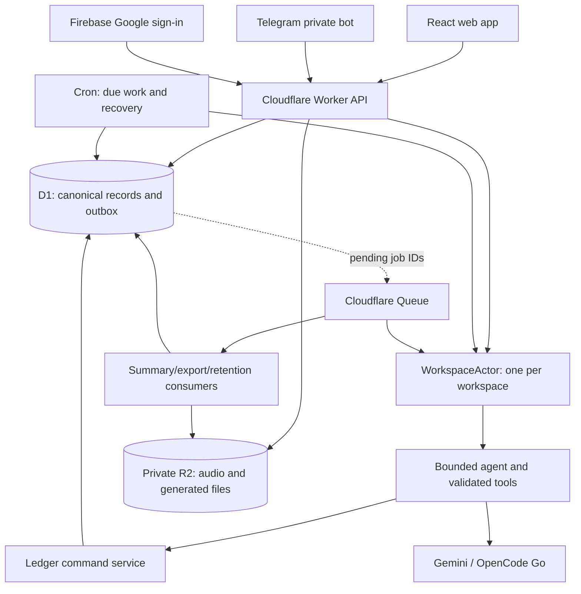

# Otis architecture

Status: implementation contract, revised 2026-09-30 against scaffold commit `a3bd462`. Most components below are planned, not implemented. See [roadmap.md](roadmap.md) for gates and [plans/README.md](plans/README.md) for execution status.

## 1. What this architecture must make true

Otis is a shared business memory operated through conversation. A member can send a messy report, leave the app, return in another chat, and continue without reconstructing the context. A teammate can inspect the report, its sources, and the changes it caused. A correction preserves history and changes current state. A provider outage cannot turn a committed change into a lost or repeated change.

The first release serves Kerning's leads, contacts, promises, drafts, and follow-ups. It is not a general browser agent. The architecture leaves a clean service boundary for later MCP access without introducing MCP into the internal request path.

Three different things persist independently:

1. **Business state:** immutable events and their rebuildable current projections.
2. **Conversation state:** chats, accepted messages, pending questions, run checkpoints, public activity, and answers.
3. **Durable context:** sourced memory notes and disposable summaries within one workspace.

Provider conversation IDs and model caches are optional accelerators. Neither is Otis's memory or recovery mechanism.

## 2. Deployment and storage responsibilities

| Component | Owns | Must not own |
|---|---|---|
| React + Vite | Rendering, local draft/outbox, recording controls, stream reconciliation | Provider keys, authorization, canonical task state |
| Worker HTTP routes | Authentication, input validation, scoped read APIs, durable acceptance, private downloads | Direct business mutations outside ledger commands |
| WorkspaceActor | Claiming and sequencing workspace work, wake-ups, bounded execution slices | The only copy of an accepted message or pending question |
| D1 | Identity, membership, inbox, conversations, events, projections, jobs, action receipts | Raw audio bytes or plaintext provider keys |
| R2 | Private retained audio, bounded upload quarantine, export objects | Public workspace files or canonical memory |
| Queue | Retryable wake-ups and background job transport | Exactly-once delivery or canonical job progress |
| Cron | Due schedules, orphaned outbox recovery, expired lease recovery, retention scans | Unattributed business mutations |
| Provider adapter | Wire formats, streaming normalization, capability/error/usage reporting | Authorization or executing tools internally |

Keep one application Worker deployment initially; its HTTP, Queue, scheduled handlers and exported DO class may share packages. Split consumers into separate deployments only for an observed operational reason. Required future bindings are `DB`, `STORAGE`, `WORKSPACE_ACTOR`, and a documented Queue producer/consumer binding. The present scaffold does not yet configure Queues or Cron.

Local, staging, and production have separate resource bindings and secrets. `pnpm dev` uses local simulated resources. A real resource ID in a config does not authorize remote migrations. Use explicit environment flags for remote commands; never make a developer test contact production by default.

D1 and R2 jurisdiction must be verified at provisioning. Include DO storage, Queue contents, telemetry, provider processing, and Firebase in the data-flow inventory. Do not describe an EU D1 flag as a guarantee that every byte stays in the EU. Queue payloads carry identifiers rather than transcripts; this reduces duplicated private data but is not a claim that identifiers are non-personal.

## 3. Package and dependency boundaries

| Path | Responsibility and public boundary |
|---|---|
| `packages/contracts` | Versioned runtime schemas and TypeScript DTOs; no network or database access |
| `packages/identity` (planned) | Firebase verification, sessions, memberships, invites, lifecycle, encrypted provider configuration |
| `packages/ledger` | Business commands, event schemas, pure reducers, transactional repositories, undo |
| `packages/agent` | Context assembly, provider adapters, tool proposals, run policy, bounded tool loop |
| `packages/memory` (planned) | Scoped retrieval and summary construction; canonical note writes call the ledger |
| `packages/commands` (planned) | One slash-command registry/parser/dispatcher used by both channels |
| `packages/channels` | Telegram/web transport formatting and delivery contracts |
| `packages/brief` (planned) | Pure time/candidate selection and scheduling helpers |
| `packages/sheet` | Pure export projection and XLSX generation |
| `packages/design` | Semantic visual tokens and shared UI primitives as actually needed |
| `apps/worker` | Composition root: injects bindings, principals, clocks, providers and repositories |
| `apps/web` | UI, typed API client, local draft storage, accessible interactions |

Do not add empty service packages merely to mirror this diagram. Introduce each when its owning plan implements behavior. The ledger must not import agent or channel code. An HTTP route, Queue consumer, cron job, callback, and eventual MCP tool all invoke the same business command services.

Use prepared SQL and versioned SQL migrations for v1. An ORM is not required; the old optional Drizzle suggestion is retired. If an ORM is later proposed, prove it can express the same transaction guards, FTS operations, and workspace constraints without weakening tests.

## 4. Identity and authorization

A user is a person. A membership links that user to a workspace. Do not add a second 'member account' or role hierarchy. All current members have equal access to shared business data and history. Each chat has one author; other members read it and act from their own chats.

Firebase Google sign-in establishes `firebase_uid`. The Worker verifies the token signature, supported algorithm, key ID, issuer, project audience, subject, expiry and required time claims using cached Google verification keys with bounded refresh. Validate verified email only for accepting a matching pending invite; later identity uses UID. Use a maintained Workers-compatible JWT verifier where useful; do not implement cryptographic primitives.

Exchange a verified ID token for an opaque random server session. Store its hash, user, expiry, revocation and authentication time in D1. Production cookies are HttpOnly, Secure and SameSite; validate Origin and a CSRF token for mutations. Logout invalidates the server session. Session lifetime is a named security configuration with an explicit deployment value. Test expiration and revocation with an injected clock. Development identity injection, if needed, is local-only and absent from deployed entrypoints.

Every request resolves a trusted principal. Workspace repositories require a scoped context produced by authentication, never a model-supplied workspace/user ID. A caller-supplied path ID is a lookup target, not proof of access. Query by `(workspace_id, resource_id)` and use composite foreign keys/unique keys where practical. Re-check membership before sensitive reads and in the mutation transaction; cached membership cannot authorize a late write after removal.

An author can append to their own chat. Everyone can inspect all workspace chats, including before joining, retained voice audio, public provider summaries, tool activity and corrections. Everyone can correct shared business state and undo a teammate's action from their own chat. Nobody can impersonate another author. Personal communication preferences are scoped to `(workspace, user)`; updating another person's personal preference is not implied by equal access to shared business records.

Owner is a lifecycle marker. Only the current owner transfers it to a current member. Others cannot remove the owner; the last membership cannot disappear. Transfer, removal, invite acceptance and settings replacement must use transaction guards against concurrent changes. Membership history is audit data, not permission to retain access after removal.

Secrets: one encrypted credential per `(workspace, provider)`, AES-GCM with fresh nonce, a versioned wrapping key in Worker secrets, and workspace/provider/version as authenticated associated data. Return only configured/invalid/last-verified status and a safe display label. Never return ciphertext or old raw keys to the client. A key replacement changes future provider calls and invalidates relevant availability checks; document whether an already dispatched request may complete. Rotation requires decrypt/re-encrypt verification before retiring the old wrapping key.

## 5. Schema order and ownership

Plan numbers identify work packages; they are not migration numbers. Existing planning paths such as `0004_memory.sql` were suggestions and must not create dependency cycles.

Execute storage foundations in this order:

1. **003A — identity foundation:** users, workspaces, memberships, membership audit, invites, sessions, provider settings and workspace revision/lease foundation.
2. **004A — conversation and source foundation:** chats, messages, inbox, system jobs, execution runs, steps, public activity, pending clarification and outbox. No LLM required.
3. **002 — ledger:** entities, aliases, events, action receipts, projections, tasks, drafts and guarded commands; source tables now exist.
4. **003B / 004B:** finish user settings/lifecycle integration and durable actor dispatch with the ledger.
5. **006:** memory projections, FTS and refresh jobs; **010:** media metadata; **011:** schedules and brief records; **012:** exports if not already introduced as minimal metadata.

Reserve the next migration number only after inspecting `migrations/`. Record table ownership and introduced migration in the implementation report. Never edit a migration already applied outside disposable local tests; append a forward migration. Initial owner/workspace circular references need nullable bootstrap owner inside a single creation transaction followed by assignment, or an equivalent tested FK-safe sequence, not disabled foreign keys.

Every workspace-owned table carries `workspace_id`, including aliases, activity, media and memory references. Pre-routing inbox rows may have null workspace/user; identity and link-code tables are explicit scope exceptions. Sources must belong to the same workspace when a ledger event references them. Member events have `source_message_id`; system events have `source_job_id`; exactly one is non-null. `channel` is required with v1 values `web`, `telegram` or `system`; scheduled/system events use `channel='system'` with a durable job source. System actors are a typed kind/named job, not fabricated human users or synthetic chat messages.

Core records and wire enums are specified in [docs/contracts.md](docs/contracts.md). Event payloads include `schema_version`. JSON is for validated payloads, not an excuse to hide query-critical state or permissions in blobs.

## 6. Durable message acceptance

### Web

The client creates a UUID once when the member presses Send. A retry reuses it. The Worker checks session, membership, author, payload bounds and chat/workspace relationship, then atomically stores the member message, inbox record, accepted execution record and dispatch outbox entry. Return 202 only after this commits. A duplicate with the same owner/chat/payload fingerprint returns the original IDs; a reused ID with a different payload returns a conflict. Never return another member's message merely because a UUID collided.

The client must show its local bubble immediately. 'Saved' means D1 acceptance is confirmed; it does not mean tools finished. Network loss after acceptance is resolved by reusing the UUID and fetching the authoritative run state. The scoped local outbox and frontend ownership contract is in section 17; it does not introduce a second business authority.

### Telegram

Validate webhook secret and supported private-chat shape before storing. The durable transport key is the bot installation plus Telegram update ID; this becomes the canonical channel `external_id`, unique with `channel`. Do not merge updates from different bot installations. Link verified Telegram user ID to a Otis user; never use display names or the voice speaker to infer identity.

Unlinked/ambiguous inputs remain unrouted and cannot reach the agent. A user selects a workspace through the verified identity's own active selection. A web view change never mutates it. The active Telegram chat is durable per identity/workspace. A routed update atomically creates its attributed chat message and outbox work before acknowledgement.

Unsupported photos/location retain dedupe metadata only. If attached text needs separate handling, ask once whether to process only that text; do not silently drop the attachment and claim the whole request succeeded.

## 7. Actor sequencing, leases and restart recovery

Each workspace has one named actor. The actor runs at most one mutating agent turn at a time. D1 assigns a monotonically increasing acceptance order within the workspace; equal timestamps and unordered queue arrival must not define causality.

The durable workspace lease stores owner attempt, fencing number, expiry and current execution ID. Claims and renewals are conditional atomic operations. A new claim after expiry increments the fence. Every business commit checks the current fence/owner and live membership inside the same transaction as its effects. An old provider response arriving after lease loss cannot commit a write.

An in-memory processing flag is an optimization. It is never the only lock or recovery record. Do not hold `blockConcurrencyWhile()` across model calls, Telegram requests, audio processing or a human answer. Break long work into bounded slices, persist a checkpoint and continuation outbox entry, and return. `waitUntil` alone is not durable continuation. Choose and test lease duration/renewal against provider timeout and Worker limits in the runtime spike.

During a human clarification, store the original request, intended action, candidate IDs, source revision and question; mark the run waiting and release the workspace slot. Other members continue. A reply schedules a continuation, revalidates current facts, and resumes without repeating committed steps. Never assume the old candidate set is still current.

Commands that do not mutate business state may be processed without an LLM. Model-setting commands still respect chat message acceptance order. Snapshot model/credential configuration when an agent run starts after applying earlier settings commands. Later setting commands do not retroactively change that snapshot.

A stop request can interrupt between tools, invalidating the active execution fence/continuation as needed. It preserves already committed actions. 'Stop' is not undo. A failed or stopped run can report partial completion and expose its successful actions.

## 8. D1 business commit protocol

Cloudflare documents transaction rollback for a failed statement in `batch()`. It does not make a zero-row UPDATE an exception. Design and test a transaction guard, not an optimistic check after other writes already committed. [D1 batch reference](https://developers.cloudflare.com/d1/worker-api/d1-database/)

Required command sequence:

1. Accept trusted workspace, actor, source, action ID, attempt/fence and expected business revision. Model arguments contain only permitted domain values.
2. Look up an existing action receipt. If this exact action/payload already committed, return the recorded result. A reused action ID with different arguments is a conflict.
3. Read current state and calculate the pure proposed projection. Validate semantic dependencies and source provenance.
4. Submit a single D1 batch that **fails** if membership, source ownership, current business revision or fence is invalid; appends receipt/events; updates projections; increments revisions; persists successful public activity and refresh/outbox markers.
5. Return success only after the batch commits. On a guard conflict, discard the proposed projection, reload and re-evaluate; never blindly retry an obsolete business interpretation.

One acceptable SQL design inserts a command receipt with a `guard_ok INTEGER NOT NULL CHECK(guard_ok = 1)` value calculated from `EXISTS`/revision/lease subqueries inside the transaction, before subsequent mutations. A stale guard inserts zero and causes the whole batch to fail. Do not use `INSERT ... SELECT ... WHERE` that silently inserts zero rows as the guard. The executor must prove the chosen implementation with actual D1 tests: injected failure late in the batch, concurrent same-revision commands, duplicate receipt, expired fence and removed member all leave no partial effects.

Keep separate monotonic business and memory/source revisions where appropriate. Projection ordering uses a committed event sequence, not random UUID ordering or wall-clock time. Preserve `occurred_at` as reported business time and `recorded_at` as server receipt time; backdated visits cannot arbitrarily overwrite newer current values.

The ledger owns entity creation, aliases that influence identity matching, business fields, tasks, draft revisions, memory notes and undo. Transport, identity settings and delivery status have separate explicit writers. Rebuild excludes non-business audit/transport state and must reproduce all declared ledger projections.

## 9. Tool steps and idempotency

Persist a planned tool step with stable `step_id`, normalized arguments hash and logical order before executing it. An action ID derives from that persisted logical step, not a provider retry's new tool-call identifier. Store provider tool-call IDs separately for protocol continuation.

The tool result and successful write activity share the durable receipt. If a process dies after commit but before feeding the result to the model, recovery retrieves that receipt and supplies it; it never asks the model to recreate the same write from memory. If the provider protocol cannot be resumed exactly, start a controlled continuation with committed action results and current state, not the original unqualified instruction.

Provider adapter events are text deltas, public reasoning summaries when available, tool proposals, usage and typed failures. Opaque provider continuation artifacts such as thought signatures are retained only as necessary for protocol continuity, never rendered as public activity or interpreted as authorization. A model must not execute opaque provider-hosted write tools outside Otis's audited tool boundary.

Final answer publication is a durable operation too: save answer and run terminal status before publishing the terminal stream event. A browser disconnect must not lose an answer. A crash after an applied action must not leave it permanently displayed as 'Working'. Reconciliation repairs activity/status from receipts.

## 10. Conflict and undo

Current field state is clear or disputed. In a dispute, current value is null and candidate event IDs retain the reports. Historical last-confirmed values remain inspectable but cannot be used as the answer or to compose an outward draft. A resolution is a new sourced event.

Do not mark every changed value disputed: an explicit correction, a temporal update and a competing report are different operations. Store causal references (`supersedes_event_id`, resolution candidates, dependency IDs) needed for deterministic replay. When semantics are uncertain, the model asks and code records the resulting choice.

Default UI rollback is **Undo from here**: selected successful action plus later successful business actions in the same run. Secondary action: **Undo only this action**. Read calls, thoughts, chat messages and unrelated later runs are not reverted. Show the exact selected action set and effects before a multi-action rollback; conversational confirmation works.

An undo group has a stable operation ID and is atomically all-or-nothing. Compute effects by replay with the selected original actions suppressed, preserving later independent actions. Append attributed revert events; do not delete the originals. If another run depends on a selected action, return a typed dependency conflict with the affected records and ask a narrow question. Never broaden the group to a teammate's work automatically. If the originating run is active, stop further steps first and obtain a stable action set.

Bare `/undo` selects the most recent reversible action in the requesting member's current chat. A target phrase can identify a prior action or run. Repeated undo is idempotent. Undoing a 'sent' record corrects Otis's record; it cannot unsend a real message. V1 does not implement redo or a global workspace time-machine.

## 11. Context, memory and caching

See [the memory contract](plans/workspace-memory-cloudflare.md). The core rules are:

- D1 stores sourced memory entries; typed facts and settings take precedence over prose.
- Preferences stay within their original workspace and, for personal tone, their member subject.
- Current fields, pending question and latest request are protected context; optional older excerpts can be budgeted away.
- Forgotten/superseded entries are excluded from retrieval, including episodic retrieval that would re-promote the same preference. Record suppression/source references so an old chat excerpt cannot silently resurrect forgotten standing memory.
- FTS queries join to active workspace-filtered records; model snippets are not the authorization boundary.
- Summaries are caches published only against a still-current source revision. Failed summaries do not stop ordinary turns.
- Summary refresh jobs are transactionally recorded alongside source changes, then dispatched through the outbox.

Use deterministic extractive summaries first. Do not add vector storage until a measured retrieval failure justifies it. A generated `memory.md` view may aid inspection later; it is never the authoritative editable store.

Prompt caching: static versioned instructions and ordered tool schemas first; changing user/workspace/time/retrieval context afterward. Preserve one stable provider session identifier per chat. Never reuse private workspace cache material across workspaces. Log reported cached tokens and distinguish unknown from zero. Cache hits are not guaranteed. Explicit provider cache resources stay off for dogfood unless measurements justify their storage/creation costs and invalidation policy. Endpoint families have different cache/continuation semantics; record the actual tested family. [Gemini caching](https://ai.google.dev/gemini-api/docs/caching), [OpenCode Go](https://dev.opencode.ai/docs/go/)

## 12. Public activity and reconnect

The server persists ordered activity before broadcasting. Use one monotonically increasing public cursor per chat, allowing events from several runs to interleave unambiguously. The client deduplicates by event ID/cursor and reconciles optimistic message UUIDs to server IDs. Do not infer write success from a text delta.

Implement same-origin SSE for live activity and a cursor-based catch-up endpoint. A connection that expires reconnects and rechecks membership. Periodically revalidate long-lived subscribers, and close them promptly after membership/session invalidation; never cache authorization for an unbounded socket lifetime. Fetch the authoritative transcript/status when a cursor has aged out, with a resync-required response rather than silent gaps.

High-frequency text may be coalesced into durable chunks before publication. Do not write one D1 row per token. Coalescing may delay a chunk slightly; it must not publish committed-looking content that recovery cannot reproduce. Durable tool state and final answer are mandatory even if an optional typing indicator is ephemeral.

Read-only teammate chats consume the same stored transcript and public activity. They have no composer and cannot append as the author. An Undo request is authored by the viewer in their own chat and links to the inspected action.

## 13. Voice, files and membership revocation

Voice has two separate phases: get a trustworthy transcript, then run the text tool loop. Route automatically from the verified capability registry, never by attempting unsupported requests. Snapshot the conversation model and transcription route when accepting the message (before inference); the server confirms the route against the validated actual recording format. Prefer the selected model's verified native transcript path; otherwise use the workspace-configured, disclosed Groq STT model. A text/tool model without native audio remains usable with this route. Workspace configuration authorizes automatic routing without per-message approval. If neither path is valid, voice is unavailable. Native auth/quota/outage failures do not trigger an undisclosed provider switch.

The Worker uploads validated private bytes to Groq using server-only encrypted workspace credentials and multipart HTTP; do not expose an R2 public URL or run Whisper weights in a Worker. Keep transcription work outside the workspace mutating-turn lease, then queue the existing actor only when its durable transcript is ready. D1 holds route/version, media identity, transcription status, attempt/receipt and transcript metadata; R2 retains private audio for the existing 14-day policy. Persist transcript before enqueueing the agent, and reuse it across agent retries. Lost STT responses may require another inference request, but conditional receipts/fencing permit only one authoritative transcript and one logical agent dispatch. Do not promise external exactly-once inference. See plans/010-groq-stt-handoff.md.

Android WebM/Opus, iPhone MP4/AAC and Telegram OGG/Opus require real capability evidence. Detect recording MIME support rather than assuming a browser name determines it. Do not promise live interruption, background recording, or survival of device/browser termination.

Reject declared oversized/over-duration/unsupported media before fetching where possible. Actual duration cannot always be trusted from client metadata: a bounded private quarantine upload may be needed to inspect it. Keep quarantine inaccessible to normal retrieval; no transcription/business writes until validation succeeds. Reject and delete invalid bytes promptly. This resolves the old impossible promise to validate every unknown audio duration without ever reading its bytes.

Accepted raw audio expires after 14 days. Keep transcript and source links. A missing recording then displays 'Audio expired' while the transcript remains readable. Local unsent drafts/blobs use IndexedDB where available, scoped by user/workspace/chat, with explicit recovery on return; logout/shared-device cleanup removes local private content. Browser storage is best-effort, never presented as server acceptance.

Expose private audio and exports through an authenticated Worker route that checks current membership on every request, supports bounded range reads where needed, and streams R2 content. A 15-minute download ticket is additional scope/expiry, not a replacement for membership. A raw R2 presigned URL is a bearer capability and cannot provide immediate membership revocation, so do not expose one for workspace files in v1. [R2 presigned URL behavior](https://developers.cloudflare.com/r2/api/s3/presigned-urls/)

## 14. Briefs, reminders and delivery

Scheduled brief delivery is opt-in per member/workspace. No hardcoded send time. A member chooses local time, IANA timezone, days and delivery channel through conversation or settings; `/today` works on demand. Disabled schedules do not send. Start with at most one scheduled brief per selected local day; additional schedules require an explicit later product decision. A missed deadline is not invented to fill a brief, and an inferred status is not silently committed to rank or filter work.

Date-only task deadlines and timed reminders are distinct; see the date union in contracts. Selection is deterministic and stores item IDs in the brief so 'I did the second one' refers to the displayed list, not a newly sorted query. The model can phrase the selected items; it cannot add an invented obligation or deadline.

Cron computes due local schedules, including DST, and creates a unique brief row `(workspace,user,local_date,scheduled_daily)`. The stored kind does not imply morning; user-facing copy says “Your brief.” No qualifying items means no outward notification; on-demand `/today` still answers.

Web is the canonical visible copy of a brief. Telegram is an optional notification of that same record, not a second brief. 'Web' delivery in v1 means in-app visibility, not a push notification while the app is closed. Explicit one-off reminders have their own job and dedupe key; they do not reuse the daily brief key.

Telegram cannot be assumed to provide idempotency for `sendMessage`. Outbox state distinguishes not-started, sending, delivered, failed-known and outcome-unknown. A lost response after send is not automatically safe to retry. Preserve the canonical web answer, quarantine uncertain delivery, and expose a deliberate retry with possible-duplicate wording. Do not promise automatic reconciliation by reading the bot's sent history when the API does not offer that mechanism.

## 15. Failures, budgets and observability

| Failure | Required observable result |
|---|---|
| Lost HTTP response after D1 acceptance | Same client UUID returns same message/execution |
| Crash before Queue publish | Pending outbox scanner redispatches job ID |
| Duplicate Queue delivery | Lease/receipt makes duplicate harmless |
| Provider times out before any write | Saved request with retryable error, no fabricated result |
| Provider fails after one write | Successful action visible; remaining work named as incomplete |
| Lease expires while provider responds | Stale attempt cannot write; recovery uses checkpoint |
| Member removed during a turn | Next read/commit fails; subscriptions/files denied |
| Old summary finishes after correction | Revision guard rejects publication |
| Media validation fails | Quarantine purged; no business events/transcription call |
| Telegram send outcome unknown | Delivery status uncertain; no blind repeat |
| Scheduled brief tick repeats | One canonical record and one deliberate delivery attempt |

Use named deployment bounds for input length, media bytes, query rows, tool calls, provider timeout, run budget, attempts and workspace daily usage. Initial engineering defaults belong in contracts; provider/action budget values require recorded measurement before real dogfood. Default safely, but do not silently drop user input to fit a cap.

Counts of applied business actions come from receipts, not number of HTTP attempts. History, model selection, direct undo and answering existing clarification remain usable when ordinary run budget is exhausted. Prevent an unbounded 'clarification' loophole: completion of the already authorized operation is bounded and cannot open a new free run.

Logs contain correlation IDs, timings, bounded error classes and counters. Do not log raw prompts, transcripts, keys, full provider bodies or download tokens. Maintain separate metrics for acceptance, provider latency, tool time, retrieval, queue lag, cached usage and corrected/wrong writes. Unknown cost is null with reason, never a zero-cost assertion.

## 16. Operations and verification

Every applied change must be recoverable through replay or explicit operational repair. Test migrations from empty DB and upgrade fixtures; test projection rebuild and workspace export in staging. Export JSON includes event versions, chats, provenance, tasks, drafts, memory/suppression records and settings that are safe to export; never raw keys or session/link tokens. XLSX is a human-readable business snapshot, not the complete recovery format.

Workspace erasure is a separate audited operator/lifecycle operation, outside the agent tool set. It stops pending work, revokes access, deletes R2 objects, removes active D1 data/FTS/cache entries and records completion without retaining the erased content in a new audit row. Record actual backup retention/restoration exclusions; never claim immediate provider/backup deletion without evidence. Ordinary undo and memory-forget are not erasure.

Core verification: `pnpm typecheck`, `pnpm lint`, `pnpm test`, `pnpm build`. Integration tests must use real local Workers/D1/DO behavior; fake providers isolate semantic and failure scenarios without real costs. DOM tests do not establish browser layout. Manual native-browser checks remain required for layout, keyboard, voice and accessibility. See [verification.md](docs/verification.md).

Primary platform references, rechecked 2026-09-29: [D1 batch](https://developers.cloudflare.com/d1/worker-api/d1-database/), [DO concurrency](https://developers.cloudflare.com/durable-objects/best-practices/rules-of-durable-objects/), [Queue delivery](https://developers.cloudflare.com/queues/reference/delivery-guarantees/), [Firebase verification](https://firebase.google.com/docs/auth/admin/verify-id-tokens). Recheck API signatures and limits when implementing; these references validate platform facts, not the unbuilt application.

## 17. Frontend state, optimism and offline boundaries

Added 2026-10-03. Required target; not a claim that the new dependencies/local storage/PWA already exist. See [design.md](design.md) for interaction and [008 handoff](plans/008-ui-implementation-handoff.md) for exact work sequence. [design-tokens.md](design-tokens.md) alone owns visual values/recipes.

| State | Owner | Must not become |
|---|---|---|
| Business facts, actions and undo | D1 ledger/events/receipts | Optimistic UI business mutations |
| Accepted messages, runs and public activity | Worker/D1 with existing actor dispatch/replay | Browser-only conversation authority |
| Scoped server snapshots | One React Query cache | Copied mutable lists across several frontend stores |
| Workspace/chat route and Back | One TanStack Router integration | Parallel pushState/popstate navigation |
| Editable draft and pending local deliveries | Scoped IndexedDB module; component reads its own draft | Unscoped localStorage or a second server inbox |
| Follow/release/Jump and prepend anchor | One stick-to-bottom integration | Several competing scroll-height adjustments |
| Keyboard/viewport/composer measurements | One hook and measured composer-height variable | Per-component safe-area/keyboard subtraction |
| Static offline shell/assets | Restricted service worker cache | Cached credentials, API streams or private R2 objects |

### Local delivery is not execution

One client UUID identifies one immutable submitted payload. Local data includes schema version, account/workspace/chat scope, source content, clarification reference, local creation time, delivery state, retry metadata and authoritative IDs once known. Local messages reconcile with persisted ChatMessage.client_message_id. HTTP acceptance and activity/snapshot arrival can happen in either order.

Draft editing never changes an already submitted outbox payload. A modified failed input is a new message. Delivery retry reuses original UUID/payload; a server conflict/auth failure cannot be repaired by generating new IDs automatically. Unknown acceptance is retried with the original identity. Saved input stays saved even when its agent run fails. Re-executing a partially committed run needs the existing server receipt/continuation boundary, not another optimistic-send operation.

New-chat creation also has stable retry identity/mapping. Messages in that locally new chat cannot create one chat per retry. Before transmission revalidate the current signed-in account and resolve authoritative workspace/chat membership. Browser generation checks discard late callbacks after route/logout/revocation.

### One scoped flush owner

Persist the local operation before network delivery when storage succeeds, with immediate visible echo. Offline and foreground events wake bounded retry with backoff and Retry-After handling. The same chat preserves input order; retries may not bypass unresolved earlier acceptance. Multiple tabs share a small tested flush/claim mechanism; server idempotency remains the final duplicate-effect protection. Browser locks/storage are not trusted authorization.

A browser online flag is a hint, not proof of connectivity. Background Sync is optional; foreground/online flush works without it. A closed browser or storage eviction cannot be promised delivery. Permanent validation/access/obsolete-clarification failures pause with a message-attached recovery action. A stale offline answer never resolves an unrelated question by guessing a new target.

Logout/account change purges scoped drafts, pending sends, local recordings and private query caches and cancels flush/stream work. Revocation removes visible/local private content and prevents retransmission. Locally discarding pending input is distinct from cancelling an already accepted run. Storage/quota failures get a truthful fallback; do not label unsaved in-memory data recoverable after reload.

### Streaming and subscriptions

Use the existing persisted public cursor, ordered deduplication and authorized stream. Merge only affected records, preserving stable message keys. Completed messages do not remount when text arrives. The same renderer covers optimistic, streamed and final content. Reconnect resumes activity/snapshots, never a new model request. A final snapshot replaces the buffer only after equivalent authoritative text exists.

One query cache owns server state; one stream subscription per selected authorized chat patches it or invalidates the exact scoped query. Do not fetch every historical run on each token. Setting mutations reconcile the effective model/effort and invalidate the scoped query while ignoring older results. They retain attribution/audit outside normal model conversation context.

Ordinary acceptance initiates prompt dispatch after the D1 transaction. Queue hints and cron recover lost wakeups; the normal conversational path must not wait for cron. Preserve fences, receipts and fair sequencing; repairing user-visible latency does not authorize bypassing the commit boundary.

### PWA and voice storage

Cache only versioned static shell/fonts/assets by default. Never indiscriminately cache /api, auth, activity streams, provider requests, private audio or credential traffic. No private keys in browser persistence. Offline shell cannot attest to fresh membership/session or invent a server answer. Service-worker updates must not reload away a draft, send or recording.

Gate 010 reuses the scoped IndexedDB module for 1 s ordered recording chunks plus codec/session metadata. Validate reassembled media before offering recovery. A chunk is not necessarily an independently decodable file. Recorder/background/storage interruption can leave only part recoverable; preserve what is validated and state the limitation. Raw accepted audio's R2 retention remains 14 days, separate from unsent local data cleanup.

Keep these as concrete small responsibilities in apps/web. No new Cloudflare service, sync platform, generic state-machine engine or browser business ledger. Design feedback is local; persistence/execution is server-authoritative. Evidence requires actual lost-ack/offline/revocation/race behavior, not a library installation.
