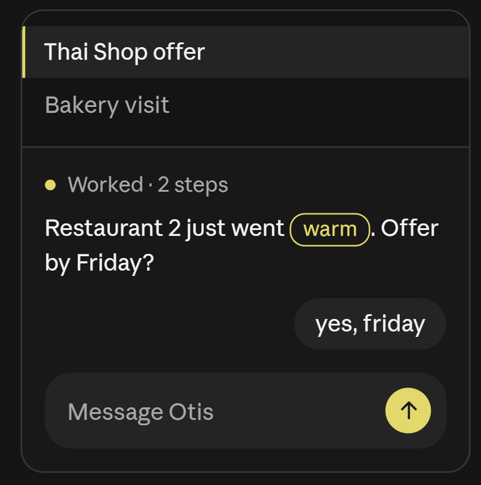

# Design Otis

Revised 2026-10-04. This is the required web interaction, layout and state contract. It describes the approved target, not proof that the live app meets it.

## 1. Authority and approved reference

Read [design-tokens.md](design-tokens.md) in full before changing any visible UI. Avi supplied that baseline and [the approved image](docs/design/approved-reference.png). The token file is preserved verbatim. It owns **all visual values, recipes, color placement, typography and voice-copy constraints**. It replaces this document's old token table, monochrome Send rule, composer toolbar and conflicting examples. Do not duplicate its values here.

The image is a miniature. Apply the production scale in token section 2, not screenshot pixels. Its outer frame is the illustration boundary, not a production chat card. Its history block illustrates row treatment; mobile history still opens in a drawer. Desktop still uses sidebar, chat and optional detail. Do not add an accent or border by sampling the image.

The supplementary [Working/Undo reference](docs/design/working-undo-reference.png) and [voice-capture reference](docs/design/voice-capture-reference.png), supplied 2026-10-04, define the compact mobile flow: a small title/workspace header, sparse transcript, expandable activity, ordinary clarification and bottom composer or action sheet. They do not replace the approved visual tokens or authorize their miniature dimensions as production values. Reuse shadcn primitives throughout, with the approved overrides; no parallel custom control system.

| Subject | Authority |
|---|---|
| Visual values, recipes, allowed highlight, font and copy constraints | [design-tokens.md](design-tokens.md), then the reference at its documented production scale |
| Interaction, presentation and fixture inventory | This guide and latest explicit user instructions |
| Business meaning, clarification, membership, memory and undo scope | [product.md](product.md) |
| Durable acceptance, authorization, retries and run execution | [architecture.md](architecture.md), [contracts](docs/contracts.md) |
| Delivery and evidence | [008 handoff](plans/008-ui-implementation-handoff.md), [plans index](plans/README.md), [verification](docs/verification.md) |

If a necessary visual value or element has no approved token/recipe, describe the exact gap and ask Avi before designing it. Routine file organization and test names remain engineering choices. Existing code shows what exists, not what is approved. Historical reviews remain evidence for their recorded version.

**Explicit behavior clarification, 2026-10-03:** Avi requires sending follow-ups/corrections while Otis works. This narrowly qualifies the token recipe's unconditional active-run Stop slot. An empty active composer shows Stop; a valid follow-up draft shows Send in the same slot. Stop remains reachable through the chat overflow while a follow-up occupies that slot, using the existing menu recipe. No second composer toolbar or simultaneous yellow-filled controls. The visual Send and Stop recipes remain unchanged.

## 2. Mental model and screens

Otis is a persistent conversation with a capable colleague. Report what happened, answer a precise question, and get back to work. Users do not manage a CRM or translate ordinary replies into forms. Save explicit complete instructions directly; ask about missing or uncertain details. A warm-status pill does not authorize an inferred status change. Missing dates still ask.

The interface must distinguish: who is speaking; which workspace owns the conversation; whether the user's message reached the server; what Otis is doing or asking; and which changes actually committed. Saved input is distinct from completed work. Copied/opened drafts are distinct from sent messages.

The field-use loop is capture, memory, resurfacing, action. Capture must feel safe under weak signal and interruption; resurfacing must explain why the remembered item matters now. The product principles in product.md define this priority without authorizing new visual recipes.

| Surface | Job |
|---|---|
| Sign-in / invite | One Google action, useful local errors, team-history visibility disclosed before joining |
| Own conversation | Transcript, actual Working, ordinary reply composer |
| Teammate conversation | Author visible, full authorized history, no editable composer; return to own chat |
| History | Own/team chats and search; selected row uses the token recipe |
| Detail | Inspect source/action/draft; Close restores transcript position |
| Settings | Personal/shared scope, effective saved values, masked connections and readable model names |
| Access lost | Stop rendering private transcript, detail, cached messages and audio immediately |

No dashboard, kanban, daily checklist, lead editor, decorative metrics or separate icon rail. Signed-in entry opens the last accessible own chat or a composer-led empty chat, never a Firebase UID/role diagnostic.

## 3. Layout, navigation and touch

Use token sections 7–8 exactly. Mobile is full-screen chat with summoned history. Desktop is one persistent sidebar and a centered conversation; detail opens only on request and only sits beside chat when the minimum chat width fits. Do not squeeze three columns into a narrow screen.

Workspace/chat are explicit route state. Refresh, Back and deep links restore that view. Switching workspace cannot briefly show another workspace's draft, optimistic bubbles, cached settings or results. History search finds chats; conversational business search retrieves business facts. Distinguish them.

The transcript is the conversation's only vertical scroller. History and a long sheet may scroll within their regions without chaining to the page. Drawer closes by backdrop, Close, Escape and appropriate Back, traps focus and returns it. Detail returns to the prior reading position.

Add overscroll containment to transcript/drawer scrollers, touch-action manipulation to controls and transparent tap highlight. Recipe-sized visual controls still need at least 44 px hit areas, extended with an ::after pseudo-element where appropriate. Targets cannot overlap neighbors or prevent text selection. Keyboard focus uses the neutral visible ring; pointer clicks do not acquire decorative borders.

## 4. Feedback and speed

Every action gives perceptible feedback within 100 ms. This is a local UI target, not a network/model completion guarantee. At 300 ms still-pending work shows a pending state inside the affected control's existing bounds. No full-screen spinner for send, settings, model change, pagination or reconnect.

No inserted footer line that moves the composer while sending. Pending/active/disabled controls keep their bounds. Work cannot disable unrelated navigation or erase the next draft. A failure remains attached to its message/control and actionable, never only in a toast. Token section 8.11 governs toast use.

Ordinary accepted messages wake execution immediately. Queue/cron provide dispatch reliability and recovery; an ordinary reply must not depend on the next cron tick. Real contention needs truthful feedback. Calling an idle queued job Thinking does not repair dispatch.

## 5. Optimistic messages and retry

On Send, create one client UUID and immutable payload scoped to user/workspace/chat. Render the bubble immediately, before network work, using the **same message component** as persisted messages. Persist locally before transport when storage is available. Preserve a newer draft when the earlier send resolves.

| Message state | Meaning |
|---|---|
| Sending | Local bubble exists, acceptance not yet confirmed; explain offline waiting in place |
| Saved | Server acceptance is known and IDs reconciled; Otis may still be working |
| Failed | Delivery failed or acceptance remains unknown after retry policy; keep bubble, reason and Retry |

Retry uses the same UUID and payload, including clarification linkage. Editing failed content creates a new input with a new UUID. Reconcile HTTP responses, replay and snapshots by client_message_id; never append a duplicate bubble. A timeout after commit means uncertain acceptance, not permission to create another run. Optimism never fabricates saved tasks, status changes, reminders, tool success or answers.

**Retrying delivery is different from retrying execution.** A failed agent run may already have committed writes. Keep its input saved; expose only a server-supported retry/continuation that respects receipts, or explain available recovery. Never resend saved input as a new run to clear an error.

Separate quiet milestones for the latest note: On device only after successful local persistence; Received after durable acceptance; Filed only after the relevant business receipts commit. A no-write conversation is Replied, not Filed; a partly applied run stays Partial and a blocked operation stays Awaiting your answer. These processing milestones complement delivery states rather than turning saved into a completed-work claim. Use existing approved metadata/control recipes; WhatsApp-style tick icons are not an approved new visual recipe. Status details and actual writes remain inspectable without persistent timestamp clutter.

The scoped IndexedDB contract is in architecture section 17. Storage failure must disclose unavailable reload recovery. Online/foreground trigger one bounded flush. Logout, account change and revoked membership cannot auto-send another person's pending content.

## 6. Streaming, Working and questions

Render text as received, without a typewriter delay, pulse, shimmer or message entrance animation. Keep completed messages mounted under stable keys; append to the active answer, not the whole transcript. Completed content must not reflow because a new token arrives.

Unfinished markdown can legitimately settle as syntax completes. Keep earlier blocks stable where possible and preserve the reader's anchor through those changes. Do not promise zero layout change in an unfinished paragraph. Disable raw HTML/unapproved embeds. Do not stream a separate component and replace it with a differently styled final message.

Working uses token section 8.7: actual current activity, static dot, chronological steps, then a compact Worked · N steps disclosure. Only successful writes expose Undo. Do not count an orchestration wrapper as useful work or infer success from model text. Use Radix Collapsible with CSS motion/reduced-motion support, no motion library. Respect manual expansion.

**Thinking lives inside Working.** When the provider actually returns displayable reasoning text or a reasoning summary, show one nested **Thinking** disclosure within that run's expanded Working history, alongside chronological tool steps. Its content updates as the provider stream arrives. It is not a separate assistant message or one disclosure per token/chunk. Reuse shadcn/Radix Collapsible and the existing Working secondary-text treatment; no new card, border, accent, spinner or typography. A small attribution identifies the provider and whether the supplied content is a summary or exposed reasoning text. Do not label a summary as the complete private thought process.

Keep the nested disclosure collapsed initially; the user can open it to watch the stream. Preserve both disclosures' manual choices through new chunks, tool rounds and reconnect. Group separate provider reasoning blocks/rounds under that one Thinking section in their original order rather than concatenating independent rounds into a fabricated monologue. Do not open it repeatedly or force the reader to the bottom. While a provider is working, the outer activity remains live even if no tool has run yet. After completion it follows the compact Worked treatment; count actual logical tool steps, not reasoning chunks, wrapper calls or output tokens. For a reply with no tool steps, use Worked without an invented step count. Waiting, partial failure and Stop retain their truthful states, never a completed-work claim.

Do not render an empty Thinking disclosure when no displayable content arrived. Thinking-effort support, reasoning-token usage and displayable reasoning are different capabilities. A model may support an effort control while returning no public text. Do not switch models, raise effort, add a model call or invent commentary to fill this section. Encrypted thought signatures, hidden prompts, keys and opaque protocol fields never enter public activity. Reasoning text is tentative provider output, not a committed business fact, tool authorization or canonical memory; it has no Undo.

On disconnect/reload, restore the received content from the existing authorized activity snapshot/cursor, without duplicate text or another model request. Preserve useful received content on Stop/failure, clearly marked interrupted where applicable. A bounded display limit must explicitly say when more provider output was omitted; silently dropping everything after a few deltas is unacceptable. Retained Thinking follows the chat's existing workspace-history access rules. Render text safely without raw HTML, automatic embeds or per-token screen-reader announcements. The additive stream contract and implementation sequence are in [contracts section 8](docs/contracts.md#8-activity-envelope) and the [008B handoff](plans/008-ui-implementation-handoff.md#thinking-inside-working).

A clarification is Otis's ordinary question, answered through the normal composer. No Alert card, uppercase Question badge or replacement task form. If several questions exist, identify the selected reply context without duplicating the question. Candidate shortcuts exist only when supplied by the server; never invent a date or consent. Waiting for a person releases the workspace execution slot so teammates can proceed.

## 7. Scroll, viewport and keyboard

Use one use-stick-to-bottom integration for follow, release and Jump to latest. Follow only near the bottom. Scrolling upward releases follow; new output then preserves reading position. Settings changes, reconnect and Working expansion do not force a bottom jump.

Use overflow-anchor and a stable anchor for older-page insertion. Assign each correction to one owner: do not run native anchoring, custom scroll-height compensation and library follow logic against each other. Test pagination while streaming and overlapping page responses.

Viewport meta is width=device-width, initial-scale=1, viewport-fit=cover, interactive-widget=resizes-content. Do not prohibit zoom. Use dynamic viewport height. Android viewport resizing and iOS visualViewport changes need one keyboard/viewport hook and one measured composer-height variable. Do not count safe-area space twice. Dispose observers/listeners.

Desktop Enter sends, Shift+Enter adds a line, except during IME composition. Mobile Enter adds a line; explicit Send submits. Autosize up to the recipe's six-line cap. Keyboard opening keeps composer and current question reachable without resetting history. Actual Android/iPhone keyboard review is required.

## 8. Composer and commands

Copy token section 8.9. One textarea, one soft surface, an actually working mic when available, and the Send/Stop slot. No toolbar row, model/thinking chips, Plus placeholder or live-call icon. Model/thinking access lives in /model, /thinking and quiet chat overflow **outside** the composer. Hide unimplemented controls.

Commands are real scoped operations. Choosing a complete model/thinking/workspace option applies it directly through the deterministic command endpoint. It does not submit chat bubbles, produce an assistant acknowledgment turn or run an LLM. Keep its attributed durable audit/idempotency receipt outside normal conversation context.

An incomplete root command opens options or inserts editable arguments, rather than executing malformed input. Sending a typed complete command uses the same operation. Use cmdk/shadcn Command with the server registry and available-model/effort data. Filtering, arrows, Enter/Tab, Escape, touch and IME must work. Escape preserves the draft. Double slash is literal text, not a command. Applying a separate overflow setting preserves ordinary draft content.

Show full readable model names and actual current/default state. Capability labels describe Otis's verified usable route, not a blanket assertion that underlying models are text-only. Native audio, Groq STT and unavailable voice are distinct. Show only verified effort options, with provider default explicit. Reconcile authoritative state after success and ignore late reads from a previous selection. Failed save leaves the previous effective value plus a local error.

Output commands such as /today, /help and /sheet need a readable predictable result, not a stream of configuration acknowledgments. Reuse shared server behavior. Do not list pretend commands or unsupported features.

While working, keep typing available and accept follow-ups/corrections via the existing server steering/ordering contract. Bind the send to the actual run/clarification and preserve its immutable accepted configuration. Do not automatically stop or restart a run merely because a second message arrives. Apply the explicit slot clarification in section 1.

## 9. Undo and correction

Prefer Undo to confirmation dialogs for reversible work. Default Undo from here reverses the selected write and later eligible writes in that run; Undo only this action is secondary. Preserve unrelated teammate work. Reads, thoughts and chat text are not rolled back.

Explain multi-action effects conversationally or in the existing inspection surface. Dependency conflicts ask narrowly. Stop an active run before freezing its rollback set. Only irreversible operations require confirmation dialogs. Undone actions remain inspectable with attribution.

The Working/Undo reference shows an **action-scope selector**, not a mandatory confirmation after every save. On mobile, an action's Undo opens the existing shadcn sheet with its exact preview: Undo from here as the primary action, Only this action as secondary, and Cancel. Show which correction and later writes will reverse, preserving messages and unrelated work. Use the existing authenticated preview/revision contract. If the preview changed, refresh it before applying; do not reverse an unpreviewed set. Desktop uses the existing action inspection surface with the same choices. No separate undo engine or ad hoc rollback logic in the client.

Edit must implement the defined edit behavior. Copying old text into a draft needs an honest label and produces a new message on Send. Undoing a sent record cannot unsend an external message. Opening WhatsApp is not sending.

## 10. Recorded voice notes

Recorded notes, text reply default. Mic appears only when recording/review/send and an available server voice path work. No live-call waveform button.

Detect MIME with MediaRecorder.isTypeSupported, not device sniffing. Validate Android WebM/Opus and iPhone MP4/AAC on real devices. Capture at a 1 s timeslice and persist ordered chunks/metadata in IndexedDB. Reassemble the complete sequence in order; individual chunks may not be playable. Verify recovered media before offering Send. Browser storage, interruption and codec integrity limit recovery; never promise every interrupted recording survives.

Meter levels come from a Web Audio AnalyserNode. Vibrate on start/stop only where supported. Handle visibilitychange and recorder interruption, checkpointing where possible; after iOS backgrounding explain plainly that recording stopped. Stop tracks and release audio context on stop/cancel/unmount.

| State | Required content/actions |
|---|---|
| Permission/denied | Local feedback, useful retry; typed draft retained |
| Recording | Real duration/level, Stop/Cancel, three-minute cap |
| Interrupted/recoverable | Explain stop; review playable saved portion or discard |
| Review | Playback/duration, Send/Cancel, no auto-submission |
| Uploading/offline | Locally retained recording where possible; same-identity retry |
| Transcribing | Actual server stage, no invented answer |
| Uncertain transcript | Ask about affected name/amount/date, normal correction |
| Retained/expired | Authorized audio plus transcript, then Audio expired |

Native/Groq routing follows verified provider evidence; no per-note route choice. Upload acceptance, transcript availability and completed work stay distinct. Gate 010 owns recording/device evidence; stories are not capture proof.

Publish the validated transcript as soon as it exists, before business filing finishes. Echo materially resolved names, amount plus currency and deadline date concisely in the answer. Flag uncertain excerpts narrowly; do not put a full Heard receipt on every recording. Stop still enters Review: auto-send with a cancel window is a proposal, not approved behavior.

Match the voice-capture reference's compact composition: retained audio appears as the user's playable note with real duration; actual acceptance/processing metadata sits quietly with it; an uncertain amount is a short ordinary question. Yes/Change shortcuts appear only for server-supplied choices and submit the same attributed clarification operation as typed replies. Saved · filing now is valid only after durable acceptance and while actual filing is underway; an idle queued item cannot claim that stage. Keep the main composer available to capture the next note while earlier work continues. The recording Stop stops capture into Review, distinct from cancelling Otis's active run; its accessible name and behavior must make that distinction explicit. No extra live-call control, record auto-send or inferred amount confirmation.

## 11. Language and accessibility

Self-host Inter variable including latin-ext. Known message language sets per-message lang to ro, hu or en based on source metadata/preferences. Mixed-language text needs honest fallback; do not label every message English. UI language and lead-draft language are distinct.

Assistant paragraphs use text-wrap pretty; titles balance; long names/URLs overflow-wrap anywhere. Use Intl formatting with explicit currency. Romanian RON uses ro-RO. Display times/date separators in the viewer's locale and workspace timezone consistently. Relative deadline interpretation still uses the source member's timezone under the server contract. Store instants UTC.

Transcript is role log with polite announcements of completed new messages only, aria-busy during streaming. Never announce each token or loaded historical pages. The handoff defines its publication boundary. Send and Stop have different aria-labels. Icon-only actions have labels; state and author do not depend on color.

Dialogs/sheets trap and return focus. Keyboard traversal, IME, 200% zoom, enlarged text, reduced motion and read-only history need actual review. Tooltip text is not the only label.

## 12. Offline and settings

PWA opens its static shell without signal after installation/caching; it cannot invent authentication, fresh data or answers. Scope IndexedDB input/recordings to the authenticated owner. Do not indiscriminately service-worker-cache private API responses, audio, credentials or provider requests.

Flush on online and foreground with bounded backoff. Background Sync is optional, never necessary on iPhone. Recheck session/membership before sending. Permanent auth/validation failures stop retry; transient/quota failures retain useful retry state. A closed page does not guarantee delivery.

Settings have explicit personal/shared scope, truthful effective values and local save feedback. Connections are masked/write-only; model names readable. Briefs start disabled with chosen time/days/timezone/channel. No 09:00 fallback, internal model shortcut, Firebase UID, stack trace or raw key in normal UI.

Briefs contain at most five useful distinct items with reason/source and working optional actions; plain-language replies map to the stored displayed items. A read-only entity timeline may open in the existing detail surface, preserving source attribution and disputed candidates. It is not another management screen. Use existing recipes; ask before introducing an uncovered timeline element. No unsolicited nudge, push or end-of-day-wrap control until its policy/feature is approved and built.

## 13. Required Storybook fixture inventory

Each ID is a story using production components, not a separately styled mock. Grouped rows mean **one story for every named ID**. Additional real-behavior fixtures do not authorize new design. Planned-feature stories are labeled contract-only and do not authorize shipped controls.

| IDs | Coverage |
|---|---|
| entry/sign-in, entry/pending, entry/failure, entry/invite, entry/revoked | Entry, join disclosure, private-data removal |
| chat/empty, chat/short, chat/long-ro, chat/long-hu, chat/long-url | Ordinary conversation, diacritics, long content |
| message/sending, message/saved, message/failed, message/retry, message/unknown-acceptance, message/local-durable, message/filed, message/partial-filed | Optimistic echo, honest capture/processing milestones, idempotent reconciliation |
| stream/live, stream/unfinished-markdown, stream/replay, stream/disconnected | Stable streaming and reconnect |
| work/running, work/finished, work/expanded, work/failed, work/partial, work/stopped | Real activity and terminal states |
| work/thinking-live, work/thinking-finished, work/thinking-absent, work/thinking-only, work/thinking-with-tools, work/thinking-interrupted, work/thinking-replay, work/thinking-truncated | One nested provider-attributed stream, honest absence, stable replay, bounded display and no fake step counts |
| question/deadline, question/status, question/entity, question/dispute, question/multiple | Conversational clarification |
| undo/single, undo/from-here, undo/dependency, undo/teammate-preserved | Effects and attribution |
| undo/mobile-scope-sheet | Screenshot composition, exact preview, primary suffix undo and secondary single-action choice |
| scroll/follow, scroll/released, scroll/prepend, scroll/prepend-while-streaming | Reading position and Jump to latest |
| composer/empty, composer/short, composer/multiline, composer/max-lines, composer/ime, composer/follow-up | One composer, including active-run correction |
| command/root, command/filter, command/model, command/thinking, command/pending, command/failed, command/literal-slash | Functional shortcuts, no chat pollution |
| nav/drawer, nav/sidebar, nav/long-title, nav/read-only, detail/source, detail/action, detail/entity-timeline | Navigation and sourced inspection |
| settings/personal, settings/workspace, settings/connection, settings/model-unavailable | Scoped configuration |
| brief/disabled, brief/configured, brief/empty, brief/delivery-unknown | Chosen schedule and truthful delivery |
| offline/shell, offline/pending, offline/reconnect, offline/storage-unavailable | Offline recovery |
| voice/permission, voice/recording, voice/interrupted, voice/review, voice/upload, voice/transcribing, voice/uncertain, voice/expired | Voice lifecycle |
| voice/recording-during-work, voice/amount-confirmation | Screenshot composition, separate capture/run Stop, server-supplied clarification choices |

## 14. Acceptance and process

Follow [token section 12](design-tokens.md#12-visual-review-checklist) at **360×800, 390×844, 900, 1280 and 1440 CSS px**. Screenshot the same representative stories at every width; record desktop heights. Interact with the actual app too. Test physical Android/iPhone keyboards separately.

Every UI increment needs production-component stories, token enforcement, targeted behavior/a11y checks, browser comparison to the reference, and evidence with commit, browser/OS, viewport, story IDs, screenshots, defects and disposition. Use native Codex/Antigravity browser controls, no Playwright. Screenshots and happy-dom geometry do not replace interaction/device evidence.

The required check-design script/portable runner and Storybook are **planned, not present at this documentation baseline**. The supplied script scans src, which is not the root monorepo UI directory. Implement the path-correct fail-closed checker in the 008 handoff. A zero-file scan or utility-only checker does not establish fidelity.

Reject toolbars, rounded sidebar cards, bordered message/question cards, dead controls, duplicate composer/message variants, persistent desktop timestamps, decorative motion, arbitrary visual values and false success states. Passing a build does not excuse them. Agents do not improve/reinterpret the design. Unknown recipes ask; known mismatches get fixed.
