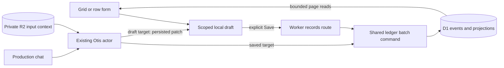

# R16 — Editable information, shared with Otis

## 2026-10-10 page repair investigation — running observations

Planning against `813bc27` plus the current working tree. The user selected a root repair of the existing page, with the supplied screenshot as evidence. Source code is being inspected directly; previous plan claims are not proof of implementation. This section is updated during investigation and will be reconciled into the execution plan.

- **Save is a second business writer.** `apps/worker/src/routes/records.ts` directly updates/deletes ledger projections, creates receipts with a fixed payload hash/revision and commits separate statement chunks. It must delegate to the shared ledger executor so retries, replay, conflicts and Undo describe actual committed changes.
- **Columns and new lists can appear saved without being stored.** `RecordsScreen.tsx` keeps additions locally; its production Save payload omits `addedColumns` and has no list-definition operation. Preserve the flexible feature and implement durable definitions instead of clearing a draft after a cosmetic success.
- **One draft is shared by all lists.** `RecordsScreen.tsx` changes `activeListId` without changing the draft. Row/column additions and deletions can appear under a different list. Scope draft recovery by member, workspace and list.
- **History contains a fabricated restore effect.** `handleRestoreVersion` only opens a success banner. Replace this with receipt-backed, conflict-aware Undo through the ledger.
- **The embedded assistant has a visual context banner, not editing context.** `AskOtisPane.tsx` forwards neither the list/row target nor unsaved values to `ConversationScreen`; the string-parsed proposal callback is not connected to a durable patch protocol. Wire one real context/patch path while retaining the production conversation implementation.
- **Controls lack hierarchy.** The screenshot and production JSX show two Ask Otis buttons and two Add row buttons, plus competing local/global searches and status options shared across unrelated lists. Define one location and a real supported effect for each control.
- **Create accepts an ID collision across workspaces.** `routes/records.ts:874–877` upserts an existing entity by globally unique ID without restricting the conflict update to the acting workspace. The replacement must reject foreign IDs before any effect and recheck authority inside the guarded commit.
- **Displayed sources and write destinations disagree.** `records.ts:302–325` reads phone/email from contacts, but `:984–992` writes generic entity fields. Latest-note, quote and next-task summaries similarly lose the source identity required to edit their actual entries. Return typed cell bindings and use the corresponding existing commands.
- **Real data is fetched at workspace size.** `records.ts:77–191` reads every entity, field, task, draft, redirect, contact and active linked interaction for all lists. Fetch the selected bounded row page and hydrate its dependencies; show actual coverage and counts.
- **Dead spreadsheet controls and misleading formatting.** `RecordsTable.tsx` offers sort/hide callbacks that the screen never supplies, row checkboxes have no bulk action, and currency uses a hardcoded euro prefix. Current production is a hand-built table; both grid libraries are installed only for earlier spikes. Adopt one production grid, preserve currency/date semantics and remove the other spike dependency after verification.
- **Draft transitions are unsafe.** Undo deletes a reverted edit whenever its previous value is empty, even if the saved base is nonempty; deleted newly-added rows are not restored. Edits can continue during Save and unconditional Discard then clears newer input. Refetch errors are swallowed before the draft is declared saved. Use immutable submitted operations, exact local inverses and receipt acknowledgements.
- **Calculations are a placeholder.** `AddColumnDialog.tsx` asks for raw expressions and fabricates `unitPrice * quantity`; no production evaluator/definition writer is connected. Implement conversationally defined, validated calculations and truthful unavailable/error states.


**Selected feature; implementation plan, not shipped behavior.** Prepared 2026-10-07 against `bee8f3b` plus the existing working tree; HEAD advanced independently to `45a4fef` before final checks. The tree is changing independently. Recheck the relevant owners and migration tip when executing; preserve unrelated work. No commit, push, deployment or external messaging is authorized by this plan. The user prohibited subagents during this planning session. The slices below are handoffs for later implementation, not instructions to dispatch agents now.

**2026-10-08 sequencing update:** the user selected [R09 targeted ledger reads and atomic field batches](ledger-write-efficiency.md) before any R16 implementation, including slice A. That prerequisite improves current chat writes and proves receipts, mixed questions, rollback, Undo and D1 costs. This feature extends that accepted writer; it does not defer the repair until spreadsheet Save or implement a second executor.

Build a dedicated **Your information** page where a member can directly edit the business information Otis uses. Desktop should behave like a spreadsheet. Mobile should make finding and editing a row easy. Users and Otis can add information, rows, columns and simple named lists. All saved business changes go through the existing ledger. Manual changes collect in a recoverable draft until **Save**; they never need a model call.

## 1. User decisions and acceptance scenarios

These decisions come from the user, not historical plans:

| Decision | Required behavior |
|---|---|
| Flexible information | Core fields plus sparse custom fields; users and Otis can create/remove rows and columns. Important unusual facts must not be discarded because the original schema lacks a field. |
| Simple for nontechnical members | Say “Your information,” “list,” “Add row,” “Add column,” “Save” and “History.” Do not expose database design, internal IDs, SQL, tool names or schema terminology in the ordinary flow. |
| Explicit manual Save | Cell, row and column edits remain local until Save. Show a useful changed count, Save, Discard and local Undo/Redo. |
| Otis cleanup | On saved information, apply authorized cleanup immediately and provide history/Undo. With an unsaved manual draft, tidy that draft; the user still clicks Save. |
| Conversation | Users request calculations, organization and more complex transformations in ordinary language. Never require spreadsheet formula programming to obtain them. |
| Devices | Full desktop spreadsheet controls plus convenient mobile editing. |
| Preservation | Tidying can reorganize and synthesize information while retaining original values, sources and relationships. A generated summary is not evidence that the original data was preserved. |

The Farsi example expresses the need to retain distinctive facts. Preferred language already exists; Otis should use it when appropriate. A fact such as “access only through loading gate after 6 pm” may need a sparse Access instructions field. These are examples, not a new fixed column template.

Release scenarios:

1. Open Leads, change a status and phone, paste five rows, add an Access instructions column and enter a value for one lead. Nothing changes on the server until Save. Save updates what Otis subsequently reads.
2. Say “remember the delivery entrance instructions for this lead.” Otis discovers existing useful fields, creates one if needed, and saves the fact through the same ledger. It appears on the information page with source/history.
3. Add a Products list in plain language or through a short name input; add Name, Unit price and Quantity. Ask “add a total column and keep it updated.” Otis creates a validated calculation; later manual quantity edits preview the new total before Save.
4. While several cells are dirty, ask “tidy the delivery details and bring the important columns forward.” Otis changes the draft, keeps source values accessible, and says it still needs Save. Unrelated edits made while Otis works survive.
5. On a clean list, ask for the same cleanup. Saved changes appear promptly with an intelligible change summary and Undo. Ambiguous facts/statuses still follow normal clarification rules.
6. Two teammates edit different cells of the same lead: both changes can succeed. Two edit the same value: retain the local draft and show the exact conflict. Never overwrite a teammate silently.
7. Save loses its response or the page reloads halfway through a large paste: recover confirmed chunks, retry identical unresolved chunks and retain the rest. Do not recreate rows or claim everything saved.
8. On a phone, find a row, tap it, change its values in a normal form, and Save. The keyboard, long text and visible Save controls remain usable.

## 2. Current source and why this is an extension

Read these owners before changing them. Documentation overview prose can lag new commits; the source is the implementation baseline.

| Owner | Current fact | Consequence |
|---|---|---|
| `apps/web/src/router.tsx` | One TanStack route `/`, existing `workspace`/`chat` search state and shared session context | Add a lazy records route; preserve existing chat links and one navigation owner. |
| `apps/web/src/ConversationScreen.tsx`; `components/HistoryNav.tsx` | The production screen owns chat orchestration; HistoryNav renders sidebar/drawer | Reuse the navigation and production chat owners. Do not clone another composer, question panel, outbox or agent loop. |
| `apps/web/src/api/queries.ts`; `api/client.ts`; `api/drafts.ts` | Scoped TanStack queries, cancellation/auth handling and IndexedDB helpers exist | Extend them for records and local draft recovery. Do not create a second generic request/cache framework. |
| `apps/web/components.json` | shadcn new-york/Radix, installed Button/Input/Select/Popover/Dialog/Sheet/DropdownMenu etc. | Use these for the shell, cell editors, menus and mobile forms. |
| `migrations/0003_ledger.sql` | `field_defs` is a reserved workspace field registry; `entity_state` stores current fields with source event, revision and disputes | Reuse both for entity custom fields. Never add a physical SQL column per user column. |
| `packages/ledger/src/commands/setField.ts`; `packages/agent/src/tools.ts` | Both currently restrict fields to status/phone/preferred_language/assigned_user_id/quote | Custom definitions need validated runtime support across commands, reducers and tools. Removing an allowlist alone is insufficient. |
| `packages/ledger/src/repository/executor.ts:821` | Every command currently loads full workspace projection state | Repair field hydration first under [R09](ledger-write-efficiency.md); R16 adds custom-definition/row/lifecycle footprints to that same owner. |
| `apps/worker/src/agent/repository.ts:1230` | `set_fields` awaits a separate executor call for each field | Replace the current chat loop under [R09](ledger-write-efficiency.md) before this feature; Save/multi-cell edits extend the accepted batch machinery. |
| `packages/ledger/src/repository/executor.ts:982` | Atomic guard, events, receipt, revision and changed-only projection persistence already exist | Extend this machinery with a bounded batch command and bulk SQL. Do not create another business writer. |
| `migrations/0002_conversations_sources.sql` | `messages_in.chat_id` is nullable | A manual Save can be a structured member input with no fabricated chat or model run. |
| `packages/ledger/src/commands/undo.ts:40` | Suffix Undo groups by run; a non-run action currently falls back to one action | Add a Save-group selector for manual chunks to the existing Undo owner. Local draft Undo stays local. |
| `packages/ledger/src/reducers/rebuild.ts` | Versioned event replay rebuilds projections | Definitions, custom rows/cells and logical removal must also replay deterministically. |
| `apps/worker/src/routes/exports.ts`; `packages/sheet/src` | Current commits include JSON and XLSX generation | Extend their actual inventory/types and formats. An exported workbook remains a snapshot, not a second writable source. |
| `apps/worker/src/routes/workspaces.ts`; `packages/identity/src/workspace.ts` | Current erasure coordinates listed D1 stores and inventoried R2 bytes | Add new stores/input artifacts to this inventory and its tests. |

At first inspection, the working tree contained `commands/deleteEntity.ts` and migration `0021_entity_deleted_kind.sql`; they were committed independently in `45a4fef` during planning. The command removes projected entity details but retains events for Undo. Its implementation is not independently accepted by this plan. Reconcile its actual lifecycle, linked-record behavior and tests before reusing it; do not introduce two competing deletion implementations.

At inspection time, installed React/ReactDOM are **19.3.0**, TanStack Query is **5.104.1**, and no spreadsheet grid dependency is installed. Migration files currently reach 0021. Choose the next number from the actual tip at execution, and check applied state before release; never alter an applied migration.

## 3. UI library and Cloudflare architecture

### Grid selection

Use **Glide Data Grid as the preferred desktop editor**, after the bounded compatibility spike in slice A. It supplies the difficult spreadsheet interactions while keeping application data ownership outside the widget. The relevant official APIs include rectangular selection, grouped cell edits, paste handling, fill and lazy cell lookup. [Selection API](https://docs.grid.glideapps.com/api/dataeditor/selection-handling), [editing API](https://docs.grid.glideapps.com/api/dataeditor/editing).

| Candidate | Fit and tradeoff | Decision |
|---|---|---|
| Glide Data Grid | MIT, canvas grid, range selection, grouped paste/fill hooks, frozen columns. Sorting/filtering stay in the data source. Stable npm 6.0.3 excludes React 19 in its peer range; `6.0.4-alpha24` includes it. | Spike and pin exactly the React-19-compatible release actually tested; alpha24 is today's candidate. Do not force incompatible peers or downgrade React. Verify keyboard, editors, bundle and accessible row editing before adoption. |
| React Data Grid | MIT, DOM virtualization and keyboard/editing support. Current `7.0.0-beta.61` supports React 19.2+. Its clipboard callbacks expose a single cell rather than Glide's rectangular batch interface. | Credible fallback if Glide fails its compatibility/accessibility gate. Verify range/paste work required before choosing it; do not hand-build a second spreadsheet engine merely to avoid one dependency. |
| AG Grid | Strong DOM grid; Community/Enterprise have different feature coverage. Range clipboard functionality is Enterprise. | Paid fallback only if its specific features justify the arrangement and the user selects the paid dependency. Community alone is not an equivalent feature claim. |
| shadcn/TanStack Table | Good headless record display with existing primitives, but spreadsheet selection/editing/paste must largely be added. | Use shadcn for the surrounding UI, not as a reason to implement every spreadsheet interaction from scratch. |
| Univer | Full workbook/editor/formula platform with many registered plugins and its own Office UI/runtime. | More machinery than this records editor needs. Reconsider only if actual workbook interchange/Excel formula compatibility becomes a selected requirement. |

Primary references: [Glide repository/license and data-source boundary](https://github.com/glideapps/glide-data-grid), [React Data Grid APIs](https://github.com/Comcast/react-data-grid), [AG Grid clipboard](https://www.ag-grid.com/react-data-grid/clipboard/), [shadcn data table](https://ui.shadcn.com/docs/components/radix/data-table), [Univer installation](https://docs.univer.ai/guides/sheets/getting-started/installation). Package metadata was checked with `pnpm view` on 2026-10-07; source README claims do not override the package actually installed.

Canvas accessibility must be demonstrated, not inferred from a library tagline. The same shared row editor also provides the DOM-based mobile/list mode and an accessible desktop alternative. Do not build an enormous hidden table or add a second grid package for this mode.

### Runtime



Use the existing Worker, D1, private R2 storage and agent actor. A manual Save is a short HTTP operation; it has no provider dependency. Otis uses the existing durable tool/run protocol. Large cleanup advances in bounded tool steps with receipts/checkpoints already owned by that protocol.

Do not add Workflows for cell saves or migrate the agent loop. Workflows support durable multi-step applications, but the existing actor/receipts already own this durability; they do not replace the atomic D1 edit boundary. This is an architectural inference from the requested interactions and current code. [Workflows overview](https://developers.cloudflare.com/workflows/).

Current official Free constraints: **10 ms CPU/request**, **50 D1 queries/invocation**, **100 bound parameters/query**, **5 million read rows/day**, **100,000 written rows/day**. Network waiting is separate from Worker CPU. Measure the actual path and include guard/index/receipt costs. [Workers limits](https://developers.cloudflare.com/workers/platform/limits/), [D1 limits](https://developers.cloudflare.com/d1/platform/limits/), [D1 pricing](https://developers.cloudflare.com/d1/platform/pricing/).

Prepared `D1.batch()` reduces database round trips and rolls back the sequence when a statement fails. JSON-array bindings with `json_each` can keep multi-row SQL below the parameter limit. Neither removes row/CPU/query budgets. [Batch transactions](https://developers.cloudflare.com/d1/worker-api/d1-database/), [D1 JSON bindings](https://developers.cloudflare.com/d1/sql-api/query-json/).

## 4. User-facing composition and interactions

### Navigation and page

- Add **Your information** to the existing sidebar and mobile navigation. Route: `/records?workspace=<id>&list=<id>`. Chat remains `/?workspace=<id>&chat=<id>`. Parse typed search state in the router, with no second selected-workspace/list store.
- A compact page header contains the current list name/picker and **Ask Otis**. Common existing lists are Leads, Tasks, Notes and interactions, and Drafts. Additional lists have ordinary names such as Products. Users are never asked to choose relational database types.
- The main content is the grid, using the available width instead of chat's 760 px prose measure. Keep the existing sidebar, dark canvas and optional 384 px panel recipe. Opening Ask Otis must not make the grid unusably narrow; use a sheet at intermediate widths.
- A single useful control row contains search, filter/sort, Add row, Add column and view/menu controls. When dirty, show `7 changes`, Undo/Redo, Discard and Save. Keep the primary action discoverable; advanced actions can live in header/selection menus. No ribbon, dashboard cards or duplicate toolbars.
- Start from meaningful existing information, not a blank schema wizard. For an empty list, offer Add row and “Tell Otis what you want to keep here.” Creating a list manually requires a name only; start with a normal Name column that can be renamed/removed in a custom list.
- Width, freeze preference, local search/filter/sort, selection, scroll and panel state are personal view state. They do not append business events. Shared columns/order/visibility/calculations/list definitions are business changes and follow Save/history. Do not turn dragging a resize handle into D1 writes or add personal order overrides that hide Otis's cleanup.

### Desktop grid

| Interaction | Required semantics |
|---|---|
| Click/arrow navigation | Select a cell; double-click, Enter/F2 or typing enters the editor. Do not mutate on mere selection. |
| Enter/Tab/Shift+Tab/Escape | Commit to the local draft and move predictably; Escape cancels that editor. Composition/IME Enter must not commit prematurely. |
| Shift selection and drag | Rectangular ranges, row selection, stable focus and range copy/paste. Indices are transient display positions, never record identity. |
| Copy/paste | TSV compatible with Excel/Sheets; handle quoted multiline cells, CRLF, empty cells and trailing tabs. One paste is one local Undo group. Preserve leading-zero phone/text data and formula-looking text. |
| Paste beyond rows/columns | Create draft rows/columns as needed; show the inserted extent and allow one-step Undo. Use generic labels until the user/Otis supplies meaning. Typed failures stay visible before Save. |
| Fill | Copy or deterministic numeric/date progression only when the source pattern is clear; otherwise repeat values. Never infer business status, currency conversions or deadlines. |
| Backspace/Delete | Clear selected editable values. Removing a row/column is an explicit named operation, not a side effect of a grid's default Delete callback. |
| Row/column operations | Add, rename, remove, restore; resize, hide, reorder and freeze. Built-in required identities/semantics can be hidden from this view, while ordinary custom columns can be removed recoverably. |
| Search/filter/sort | Apply to the complete selected list through scoped API queries. Do not quietly filter/sort only loaded rows. Preserve selection by IDs and disclose loading/partial read failures. |
| Long/disputed values | Truncate visually with a usable full-value editor/details view. Mark missing and disputed values distinctly; never display a candidate as confirmed. |
| Keyboard shortcuts | Ctrl/Cmd+S = Save on this page; Ctrl/Cmd+Z and redo affect the draft when outside an active text editor. Preserve text-input undo inside an editor. Saved-history Undo is an explicit action. |

Use Glide `onCellsEdited` as the grouped update hook; do not also apply every item again through `onCellEdited`. Handle paste overflow in `onPaste`; override deletion so the library cannot clear protected cells or remove rows accidentally. `getCellContent` must be a pure constant-time lookup into loaded canonical data plus the draft overlay. It must never fetch, query the server, perform model interpretation or format the whole list per cell.

### Mobile and accessible list mode

Provide a compact list/grid toggle with the same values and draft. The row list shows the name plus two or three useful values; tap opens the existing shadcn Sheet-style row editor with all visible/hidden custom fields, source/history and a contextual Ask Otis action. Label fields normally; support multiline text, choices, local dates, money and record links.

Keep Save and its dirty count visible in the affected page/sheet. Closing a row editor preserves its draft. Navigation keeps recoverable drafts without repeated confirmation dialogs. Explicit Discard removes only this account/workspace/list draft. Account sign-out and workspace access loss purge the appropriate private data; another workspace's unsaved work survives access loss elsewhere.

Use approved fonts/colors and existing neutral controls. Proposed records recipe: 32 px desktop data rows/headers, 48 px mobile row/control reach, 14/20 UI text, 16/24 form text, tabular numbers and a neutral focus/selection outline. Resolve grid theme colors from existing CSS variables; no hardcoded third-party palette. Yellow stays in its existing approved roles, not a new fill on every edited cell. Dirty cells use a small labeled marker and neutral edge; errors use destructive text plus an icon/label.

Support 200% zoom, Romanian/Hungarian diacritics, RTL/Farsi text, IME composition, pointer and keyboard editing. Focus returns to the initiating cell/row after menus/forms close. Announce row/column names and validation/conflict state. Do not rely on hover, color or tiny canvas icons for the only available action.

## 5. Data model: existing records plus flexible lists

### Identity and adapters

Use stable logical references in every UI/API/tool operation:

```ts
type RecordSource = 'entity' | 'task' | 'memory' | 'interaction' | 'draft' | 'custom';
type RecordRef = { source: RecordSource; id: string };
type ColumnRef = `core:${string}` | `field:${string}`;
type CellVersion = { event_id: string | null; revision: number };
```

Use a small explicit source adapter switch for reading, validation, command translation and affected dependencies. This is not an ORM or configurable report engine. Each built-in row refers to its existing projection or effective source event. A custom list has its own rows, journaled through the same ledger. Do not copy Leads into a second `leads` table.

Core bindings include entity name/status/phone/language/owner/quote, task title/assignee/due/status/snooze, current note content/scope/subject, effective interaction text/type/contact evidence, and outward draft content/recipient/language/status. Computed next step/last contact are useful read-only columns with a direct link to their source record. Changing one must edit the actual task/contact, not write a synthetic lead field.

The current TypeScript `EntityKind` union and runtime entity `kind` string are not identical. Do not silently reclassify all existing records or turn arbitrary custom lists into leads to reuse a command.

### Forward schema change

Prefer this concrete small schema extension, adapting names only to existing conventions:

| Store | Purpose and key fields |
|---|---|
| Existing `field_defs` | Workspace registry of stable custom definitions. Keep `id`, immutable `field_name` storage key, `display_label`, `value_type`, `is_core`, `is_active`; add version/source-event and bounded options/aliases/calculation metadata. Labels are mutable; IDs/storage keys are not. Existing core names keep their meanings. |
| Existing `entity_state` | Current values for entity core/custom fields. Reuse revision, source, disputes and original-value history. Resolve `ColumnRef` to the trusted definition/storage key on the server. |
| New `record_lists` | `id`, workspace, name, source family, validated selector, shared column/layout metadata, revision/source event, active flag and timestamps. Built-in default views can be code-defined until customized; user-created lists are ledger-defined. |
| New `record_rows` | Custom rows with stable IDs/list ownership, minimal name metadata and lifecycle revision/source. Also permits sparse lifecycle metadata for interaction rows when needed for removal/restoration; it does not duplicate every built-in record. |
| New `record_cells` | Sparse values for custom rows and extra fields on tasks/notes/interactions/drafts. Key `(workspace_id, source_kind, source_id, field_def_id)`. Typed value, clear/disputed state, source event, revision and timestamps. Entity values remain in `entity_state`. |

Column membership/order/visibility for a list can be a bounded JSON array in `record_lists`; a junction table is unnecessary until actual size/use requires it. Personal width/freeze/search/sort preferences are stored locally. Keep layout out of cell/value rows. Removing a custom column from one list does not delete values needed in another list; use explicit “Remove from this list” versus a scoped, recoverable “Remove everywhere” operation when a definition is shared. Core fields can be hidden from the view while retaining their required meaning.

The existing definition types are string/number/boolean/enum/date/currency. Reuse them, with safe text as the default. Store choice options and format metadata in bounded JSON; record references may use a validated option on a text-like definition rather than immediately rebuilding the type CHECK for many speculative types. Do not treat inferred text that looks numeric as permission to lose formatting. Currency values retain currency plus integer minor units; dates retain calendar/instant semantics where applicable.

Initial indexes: existing workspace/entity/field uniqueness; list active/order keys; custom row workspace/list/active/id; cell workspace/source/id/definition for page hydration; definition lookup; and the effective event supersedes/revert lookup needed by interactions. Add value indexes only for the actual full-list filters/sorts implemented, informed by `EXPLAIN QUERY PLAN` and row metrics. Do not create one physical index or generated column per user-created column.

For numeric/date/text custom sorts, provide a shared typed sort representation and index by workspace/definition/value/row, not one index per definition. `record_cells` can keep a numeric sort value alongside its canonical typed value; extend entity field persistence similarly only for sorts implemented. A LIMIT on an unindexed JSON scan does not establish bounded read cost. D1's 100 physical-column limit does not limit the number of user fields stored as sparse values.

Clear is a versioned null/tombstone, retaining source/revision even when the visible value is blank. Do not delete a field's revision token and then treat it as never-existing: that would let stale absent-value edits bypass conflict checks. A removed row/column rejects ordinary edits until explicitly restored. Incompatible column-type changes create a successor definition with retained originals/lineage rather than silently reinterpret all old values under a new type.

### Events and replay

Use existing core command/event kinds for ordinary records. Add versioned events for list definition changes, field definition changes, custom/interaction row lifecycle and non-entity custom cell changes. Include stable IDs, actual old/current source versions and explicit dependencies/lineage when transforming data. Extend contracts, SQL kind constraints, pure reducers, rebuild state, persistence and export together.

Existing event-table CHECK changes require careful migration handling of triggers, self-references and downstream foreign keys. The evolving 0021 migration demonstrates why blindly dropping/recreating `events` is unsafe. Use actual local D1 migration tests seeded with self-referencing events, tasks, fields, drafts, memory and receipts; assert byte-equivalent retained event data and all references after the forward migration. Never change an applied migration or rely on disabling foreign keys across unrelated remote requests.

Replay must produce the same definitions, active/archived rows, values, disputes, calculations and relationships as ordinary commit. No current fact or definition may exist only in grid JSON, actor RAM, a cached summary or an exported workbook.

### Built-in editing rules

| Source | Translate manual edits through |
|---|---|
| Leads/entities | Existing create/rename/alias/status/field commands, extended for registry-backed custom fields. Explicitly choosing a status is stated intent; an agent's inferred existing status still asks. Duplicate/near-match creation returns a useful existing-record choice without dropping other edits. |
| Tasks | Existing create/update/done/cancel commands. Distinguish a local date, explicit instant and deliberate No deadline. Do not create missing deadline assumptions. Preserve task identity and actual assignment permissions. |
| Notes/memory | Existing memory commands and explicit sourced corrections. Removing remembered information follows suppression/forget semantics so old conversation cannot silently reactivate it. Preserve subject, scope, observed date and source. |
| Interactions | Append sourced corrections using `supersedes_event_id` and stable original-row identity; lifecycle removal is journaled. Extend effective-event reads to exclude superseded/reverted/archived claims. Never UPDATE raw historical events. |
| Outward drafts | Existing draft create/revise/archive semantics. A Sent control requires the member's explicit completed-send assertion. Copy/opening an external app remains separate. |
| Custom rows | New small ledger commands/reducers for row/cell lifecycle. Use the same identity, source, guard and receipt rules. |

Core entity removal must use the reconciled entity lifecycle once, including an intelligible summary of associated projected details and a complete restore/Undo test. Cancelled tasks and archived drafts use their existing semantics. Interaction correction/removal must also update last-contact and briefing reads consistently; keeping an old contact active would be a functional error even if the grid looks correct.

## 6. Read API and page performance

Add explicit records routes to the existing Worker HTTP composition and methods/types to existing web/shared API owners:

| Route | Contract |
|---|---|
| `GET /api/workspaces/:ws/records/lists` | Available simple lists and revision; no row payloads. |
| `GET /api/workspaces/:ws/records/:list` | Definitions/capabilities, lightweight list-picker summaries and first bounded row page; optional known revision/selected columns/filter/sort. This is the one initial data request after session/navigation; do not wait for a separate lists fetch before requesting rows. |
| `GET /api/workspaces/:ws/records/:list/rows` | Next/previous/last keyset page, stable row IDs and cell versions, declared filters/sort and next cursor. |
| `POST /api/workspaces/:ws/records/:list/changes` | One bounded immutable Save chunk; section 7. |
| `GET /api/workspaces/:ws/records/changes/:actionId` | Scoped receipt recovery after an uncertain Save response. |
| `GET /api/workspaces/:ws/records/:list/history` | Bounded history by record/column/change group; original values and actor/source. Reuse existing action/source inspection where appropriate. |
| `POST /api/workspaces/:ws/records/contexts` | Private immutable draft context upload when sending a draft-aware Otis request; section 9. |
| `GET /api/workspaces/:ws/records/draft-patches/:stepId` | Scoped persisted draft patch recovery; no live polling loop. |

Every route uses current `requireWorkspaceScope`; mutations enforce existing CSRF. List IDs and record IDs are selectors, not authority. Select only the current workspace, validate source ownership and reject unsupported keys/sort expressions. Do not accept arbitrary SQL, unchecked JSON paths or model/client-supplied tenant/actor values.

Read strategy:

1. Fetch a bounded page of primary rows, then hydrate requested custom/core fields in one or a few batched prepared queries over row IDs/definition IDs. Use `json_each` or parameter-aware ID chunks. No request/query per cell, row, owner name or next task.
2. Query indexed core filters/order and stable ID tie-breaks. Custom-value filters use trusted definition/type metadata and parameterized predicates. Include null/disputed ordering and currency semantics explicitly. Cursor contains the last typed key/ID and is validated against workspace/list/filter/sort, not used as permission.
3. Return a page revision and per-cell versions. Exact full-list counts/totals are optional secondary work, never a gate to first rows and never “counts of loaded rows” presented as the whole list.
4. Start around 100 rows/page, maximum 200 as a measured initial configuration. Prefetch the next page near the viewport tail; abort obsolete reads on list/workspace/filter changes. Batch column-window reads only if broad-column payload measurement justifies it.
5. Use a loaded-row plus loading-tail model; do not give the grid millions of fake empty rows or fetch random cells during paint. Provide a last-page seek for Ctrl/End and explicit full-list Copy/export rather than loading everything just to count or scroll.
6. Keep a bounded page cache with row-ID mappings and retained dirty rows. Selection survives sorting/refetch by record/column IDs. For large ranges, copy/export through bounded source reads with truthful progress and cancellation.
7. New data cannot overwrite dirty values. A Save acknowledgement cannot be replaced by an older outstanding read: cancel affected reads before applying its authoritative result and reject/overlay older revisions until a read covers that result. Reproduce this with delayed query returns; do not repeat R01's accepted-row clobber path.

Initially use normal primary D1 reads. Existing code does not establish a replication/session rollout for this feature. If read replication is enabled later, pass a D1 session bookmark from Save to subsequent reads or use first-primary where read-your-write matters; the Sessions API is required to use replicas. [D1 sessions and bookmarks](https://developers.cloudflare.com/d1/best-practices/read-replication/).

Refresh on Save, relevant completed Otis actions, window focus/reconnect and explicit Retry. Do not add a D1 heartbeat just to watch cell changes. Live teammate cursors/coediting and CRDT/OT are separate features; granular conflict handling supplies useful collaboration now.

While a draft is dirty, preserve affected row positions and keep dirty/new rows visible even if their proposed values no longer match the saved filter. Label that state; do not hide an unsaved edit because a server refetch reorders/filter-excludes its base row. Reapply complete-list order/filter after Save or an explicit view refresh, preserving the focused record by ID.

## 7. Save transaction, provenance and concurrent editing

### Operations and immutable request

Keep operation shapes explicit; names may follow repository conventions:

```ts
type RecordsChangeRequest = {
  save_id: string;                 // UUID of this user Save intent
  action_id: string;               // immutable chunk ID, e.g. save_id + ':0001'
  chunk_index: number;
  chunk_count: number;
  list_revision: number;
  operations: RecordEdit[];        // stable row/column IDs + touched-value versions
};

// RecordEdit is a validated union: set/clear cell, create/rename/archive/restore
// row, create/update/archive/restore column, create/update/archive list,
// define calculation, or a bounded lossless transformation. Each member has
// an op_id, explicit data and applicable base row/cell/definition versions.
```

Minimum wire shape of that union (do not let separate executors invent different operations):

| Operation | Required data/preconditions |
|---|---|
| `cell.set` / `cell.clear` | `op_id`, RecordRef, ColumnRef, base CellVersion, base definition revision; set also has a typed value. Clear stores a versioned null. |
| `row.create` | `op_id`, provisional UUID/RecordRef of the list's allowed source, initial values keyed by ColumnRef; preserve no-deadline/source semantics for built-ins. Server maps or validates IDs consistently. |
| `row.archive` / `row.restore` | `op_id`, RecordRef, current row/lifecycle version and required dependency versions/effects. |
| `column.create` | `op_id`, stable provisional definition ID, display label, supported value type/options and target list; server derives the immutable storage key. |
| `column.update` | `op_id`, definition ID/base revision and allowed label/alias/options changes; incompatible type conversion is a successor definition, not an unsafe in-place cast. |
| `column.remove` / `column.restore` | `op_id`, definition/list IDs and base revisions; explicit list-only/global scope, preserving original values. Core removal is view visibility. |
| `list.create` / `list.update` / `list.archive` / `list.restore` | `op_id`, stable list ID/base revision, allowed name/source-selector/column-layout changes. Source kind is fixed after records exist. |
| `calculation.define` | `op_id`, definition ID/base revision, typed expression and output type, stable input ColumnRefs; dependency/type validation. |
| `transform` | `op_id`, enumerated normalize/split/consolidate/summarize/group operation, exact source IDs/versions, explicit resulting cells/definitions and retained-original lineage. Expand to validated primitive edits before persistence; it is not arbitrary code or a full replacement payload. |

Typed wire values cover text, finite number, boolean, null, local date, explicit instant, currency/minor units and validated record references. Core quote edits additionally carry offered/expected role; do not treat an unlabeled “price” as a complete quote. Field definition options identify supported formats. Preserve legacy `QuoteValue`/`TaskDue` shapes at the command adapter and version changed serialization deliberately.

Responses are discriminated `committed`/`already_committed` (revision, receipt, authoritative affected values/versions, ID mappings), `validation_failed` (op/cell errors), `conflict` (op/reference/base/current/submitted) or a retryable transport/availability error. Use the repository's public result/error envelope consistently. A group-progress label derives from durable chunk receipts, not from optimistic request count. Do not use HTTP 200 plus an empty success body for a failed Save.

The request never contains trusted `user_id`, actor, workspace authority, run/fence, arbitrary SQL or executable formula code. Use a versioned canonical serializer for hashing; once submitted, retain exactly that payload for retries. Editing the payload creates a new action UUID. A list creation can use a stable provisional UUID checked for collision/ownership, or a server ID mapping; pick one consistently so later cells/calculations in the same Save can reference it.

Manual input provenance: create a structured `messages_in` record with channel web, the acting user/workspace, stable external action ID, fingerprint, raw edit intent and processed status; `chat_id` may be null. Increment its acceptance sequence within the same transaction. Do not enqueue it or fabricate an agent run. Source insertion before the existing transaction guard is supported by the executor's `extrasBeforeGuard` path; it must roll back with a failed edit.

Use an external ID such as `records:<action_id>` and bind its fingerprint/receipt to the trusted actor/workspace. Two simultaneous identical requests must resolve to one committed source/effect and its receipt after a uniqueness/guard race; different payloads or actors cannot adopt that receipt. Preserve accepted draft-patch/source references in manual Save lineage when the member saves Otis's proposed edits.

Manual edits are stated instructions. This permits an intentional correction to supersede the exact previous fact after its version is checked. Do not mark a field clear simply because the incoming client omitted dispute candidates; existing conflict resolution rules still govern disputed cells. Disputed fields open a labeled candidate/details editor and require an explicit resolution choice.

### Shared commit path

Extend `executeLedgerCommand` with a records batch command, bounded hydration and a bulk persistence option inside the same owner. Do not fork authority/idempotency code into the HTTP route or use one executor call per cell.

1. Authenticate/current membership and bind receipt recovery to that actor before returning an existing result. Identical payload + identical owner returns the committed receipt; changed payload or another actor's ID cannot replay it.
2. Batch-load workspace revision/sequence, definitions, touched rows/cells and the exact dependencies needed by the declared operations. Creation needs scoped duplicate-name/alias checks; deleting an entity needs its actual dependent projections. A partial state must never cause the executor to delete unseen rows or refresh all memory/FTS as if they were loaded.
3. Validate all operations/types/dates/relationships and touched versions, using existing pure handlers/reducers. Fold multiple edits into one next state/event sequence. Reject invalid chunks atomically with indexed cell errors; unrelated unsaved edits remain on the client.
4. Use current workspace revision for the transaction guard; compare client base versions at the touched cell/row/definition level. An unrelated workspace write can be safely rebased if touched values are unchanged. A same-cell/definition conflict is returned, never silently rebased.
5. Build one prepared `D1.batch`: source acceptance, hard authority/version guard, append events, changed projections, receipt, workspace sequence/revision, necessary FTS/summary scheduling. Preserve existing foreign-key order and stale-attempt fencing for agent calls. A failed predicate must cause a constraint/error and roll back the batch; zero updated rows are not rollback.
6. Return the committed revision, affected row/column values and new versions, action receipt and precise counts. Do not force a full snapshot read before confirming Save. No-op edits are removed before commit; an unchanged cell must not consume an event/projection write.

For fixed table families, use bounded JSON-array bindings to insert/update many changed rows in one statement when appropriate. Count all preliminary reads plus batch statements against 50 queries. Preserve one journal event per actual semantic change where current reducers require it; batching SQL does not justify compressing away provenance.

Allow at most one bounded internal retry when the workspace revision moved but all touched versions still match. Rehydrate only affected state. Under continuing contention return a retryable conflict with the draft intact; do not spin, serialize all users through a new lock service or add lease layers.

### Conflicts

The server returns conflicts with record/column reference, base value/version, current saved value/version and submitted value. The client offers **Use saved value** or **Keep my edit**, plus preservation of both as a note/detail when meaningful. Keep my edit is a new explicitly confirmed correction with the new base version and new action ID. It is never an automatic retry of a mutated old payload.

Use cell-level versions for custom/entity fields. Use an exact base-value plus current event/version token for built-in properties that lack a field revision today; add a minimal projection version/source where required by deterministic replay. Parent removal, field-type change and transformations validate all affected dependencies. Updating a different task field should not conflict merely because a teammate touched an unrelated lead.

### Large Save and grouped history

Start with a conservative server-advertised chunk limit (e.g. 100 cell operations and 128 KiB encoded input), then profile and tune it; this is not a claimed platform limit. A wide cell/complex lifecycle operation may lower that limit. Partition by estimated SQL/query/CPU/byte cost, keeping create-definition plus its dependent cells ordered. A single complex operation must fit a bounded transaction or have explicit resumable phases; never cut an indivisible dependency halfway.

Small Saves fit one atomic chunk. Large pastes use sequential chunks under one Save ID and show “Saved 3 of 5 batches” if interrupted. Persist submitted payloads and acknowledgements locally before advancing. On retry, recover receipts then send only unchanged unresolved chunks. Do not claim cross-request atomicity; earlier confirmed chunks remain saved on later failure.

Extend `ActionReceipt`/receipt storage with a nullable indexed **change_group_id** for manual Save grouping (equal to Save ID); ordinary agent receipts keep run grouping. Reuse the existing Undo preview/dependency algorithm with this additional selector. “Undo this Save” reverts its committed chunks, preserving later unrelated work. A partial Save is undoable to the extent committed. No fake agent run or second receipt journal is needed.

Groups are actor/workspace-bound; validate chunk numbering/count and never permit attaching another member's actions to a group. Cell history offers **Restore this value**, which creates a new draft edit with today's base token; it does not secretly undo the other cells in that cell's original batch. A saved Undo request is an explicit command, with the existing effect/dependency preview and a structured no-chat source where required.

Ledger Undo and local Undo are distinct: local Undo changes the draft; saved Undo appends reverts with current dependency/authority checks. After saved Undo, update affected current rows and expose its actual result rather than reset a cached workspace snapshot.

## 8. Client draft state and weak-network behavior

Use a small local draft reducer/map beside TanStack server state. One scoped draft per `(user, workspace, list)` is enough; no new global state package is needed.

```ts
type RecordsDraft = {
  id: string;
  generation: number;
  baseListRevision: number;
  cells: Map<string, DraftCell>; // stable source/id/column key, base + edited value
  structure: RecordEdit[];      // draft rows/columns/list changes
  undo: DraftOperationGroup[];
  redo: DraftOperationGroup[];
  submitted?: ImmutableSave;    // exact chunks, hashes, versions and receipts
};
```

Render `canonical rows + draft overlay`. Removing a row/column adds a draft tombstone; it does not delete the base snapshot or original values. Reverting a cell to its base removes that dirty entry. Keep input text separate from parsed typed value so errors and precise money/phone formatting survive.

Each edited cell/structural property has a monotonic **local version** in addition to its saved base version. A draft's global generation identifies the accepted snapshot, but unrelated later edits must not reject the entire returned patch. Match per-cell/property local tokens; Undo also advances those tokens so an old patch cannot bypass intervening edits just because the text happens to match again. Save freezes the submitted local tokens and clears only those acknowledged versions.

| State/event | Behavior |
|---|---|
| Clean → edit/paste | Immediate local feedback; create one Undo group per coherent operation. Coalesce typing, not separate pasted cells. |
| Dirty → Save | Freeze a submitted payload and versions; persist it locally, show pending in the Save control, then submit. Keep later user edits in a newer generation. |
| Save acknowledgement | Clear only draft operations matching the submitted versions. An edit made after submission stays dirty, even on the same cell. |
| Validation/conflict | Show exact affected rows/cells; retain the whole unsaved draft and confirmed chunks. Resolution creates a new intent. |
| Uncertain response | Do not assume failure or success. Recover the action receipt; retry the identical UUID/payload if uncommitted. |
| Offline before Save | Retain the draft and label it “Not saved yet.” Do not promise background Save without an explicit requested Save intent. |
| Reload while submitting | Recover persisted payloads/receipts, then offer/continue the user's already-requested Save. Never generate new UUIDs merely because the component remounted. |
| Read/list/workspace navigation | Abort disposable reads, retain scoped drafts. A submitted write is not cancelled just because its screen unmounts. |
| Access removed/sign-out | Use existing scoped cleanup owners, clear private contexts/drafts/payloads for the affected scope and stop dependent work. Keep unrelated workspace drafts. |

Persist draft deltas with coalesced IndexedDB writes through existing helpers; no server write on every keystroke. Detect storage failure and show “Changes are only in this tab” while keeping edits in memory. A second tab with the same draft must not silently overwrite it: use a version check/existing BroadcastChannel patterns to open a recovery choice or a separately identified draft. Do not invent distributed consensus for local drafts.

Provide Draft Discard and saved history separately. If a user discards while a Save is in flight, do not pretend the request was rolled back; recover its outcome and offer saved Undo if it committed. Save and incoming Otis patch application have generation preconditions, so races cannot erase later user work.

## 9. Otis integration: one agent, explicit edit target

### General records tools

Extend the existing `query` resources with records/list/column discovery; add **one general `edit_records` tool** whose validated operation union matches the manual Save command. It can create definitions/lists, set values, apply row lifecycle and define calculations. Keep existing specific tools where useful; the tool set must not become a separate helper for every rare column or lead report.

Share validators/read services/ledger translation between UI and tools. Server-derived context supplies workspace/actor/source/run/fence. Model row indices, labels, selected IDs and list names are hints resolved to scoped stable references. Ambiguous targets get a narrow question; visible ordering alone is not a permanent identity.

Do not dump every row/column definition into every prompt. Supply a compact current-list/selection/target description, then bounded `query` discovery and relevant cells. Exact ID/label/type matching happens in code; semantic reuse is proposed by the model and validated. Reuse core preferred language for Farsi, preserve text when interpreting is uncertain, and create a sparse reusable column only when needed. Definition aliases can improve subsequent discovery without creating duplicate fields.

Snapshot the visible row order/selected stable IDs and active filter/sort when sending references such as “the second one” or “these rows.” Keep that small view context immutable through retries/questions. A created definition cannot impersonate a reserved core key. Reuse an exact matching definition in the current list rather than duplicate it on retry; return the stable ID mapping when deduplicating compatible creations.

### Saved versus draft target

Record an immutable **edit target** in accepted message/run context:

```ts
type RecordsEditTarget =
  | { mode: 'saved'; list_id: string; selected_rows?: RecordRef[]; selected_columns?: ColumnRef[] }
  | { mode: 'draft'; list_id: string; draft_id: string; generation: number;
      context_id: string; selected_rows?: RecordRef[]; selected_columns?: ColumnRef[] };
```

Clean page → saved target; dirty page → draft target for requests to edit/tidy that information. Freeze this choice when input is accepted. If the user begins editing after accepting a clean-target request, its saved changes arrive beneath the new local draft and use normal conflicts. A target cannot switch from draft to saved because the user later saves/navigates or the actor restarts.

Draft mode is enforced in the Worker/tool dispatcher, not merely stated in the prompt. All tools capable of affecting that list's business data/definitions must translate to draft operations or return a clear unsupported/clarification result. Do not leave legacy `set_fields`, create/delete entity, note/task/draft or Undo as a route around the draft target. Ordinary read tools see saved data plus the accepted draft overlay. Explicit unrelated commands/facts outside the target follow their actual scoped intent; if a mixed request cannot be separated safely, ask a narrow question rather than unexpectedly save draft values.

### Durable input and patch delivery

When sending a draft-aware request, upload an immutable **draft delta**, including changed values/base tokens/new structures and relevant view identity, to the existing private R2 binding. Do this at Send, not on keystrokes; keep its context ID stable across the chat outbox retry. Use owner/workspace metadata and a controlled object prefix, membership/owner-checked endpoints and byte bounds. For very large deltas, store bounded chunks with a small manifest and read only relevant chunks during tool queries; do not put a complete workspace snapshot into the prompt.

Accepted `messages_in.raw_payload` retains the context ID/generation/target. Validate ownership before acceptance and again before use. The context is a source artifact for this request, not canonical business data or a mutable server draft. Include its inventory in export/erasure/retention; orphan cleanup cannot remove input referenced by a pending run. This reuses R2/source durability instead of a new draft synchronization service.

On draft-target `edit_records`, the server validates operations against saved state plus that accepted overlay and persists the resulting **draft patch** in the existing logical step result. Return target ID/generation, step/patch ID, base tokens, operations, changed count and `save_required: true`. Persist before announcing it. For large patches use bounded artifact chunks referenced by that result, not huge token activity payloads.

Later tools in the same run must see earlier completed proposed patches, including newly proposed definitions/rows. Reconstruct that working overlay from accepted context plus persisted logical step results through the existing checkpoint/step owner; retain references rather than another complete workspace snapshot. Restart reproduces the same proposal IDs. Returned counts describe proposed edits until the client has merged them; collision feedback must not be mislabeled as successful saving.

Deliver a small patch reference in existing `step_finished` activity and let the records client fetch the persisted result once. Reconnect/history catch-up recovers the same step result. Deduplicate application by logical step/patch ID; a provider retry or repeat SSE delivery cannot apply it twice. No `action_applied` business receipt is emitted for an unsaved patch. A patch accepted into the draft is one local Undo group.

Client merge rule: apply patch operations only where the draft versions still match. Retain newer user edits and surface the particular collisions; do not overwrite the draft with a returned full table. A patch for another draft/list/account stays scoped and can be offered for recovery when its owner returns. Unapplied/partially applied patches remain inspectable; “tidied” does not imply saved.

Patch preconditions include accepted local cell/property tokens and the saved versions actually used by each transformation. Reconcile newer authoritative source reads without replacing dirty cells; a changed saved dependency or locally changed property is a specific collision. Saving/discarding the original draft while Otis runs never turns its late patch into a saved command. Offer the retained patch for a new draft/review if its original target has ended.

Saved-target tool calls use the same batch command/ledger receipts as manual Save, with the existing run fence and step identity. Agent cleanup can publish truthful Working/action summaries and Undo after actual commit. Do not introduce a second formatter model, fake reasoning or an extra confirmation loop for unambiguous authorized organization.

### Reusing the actual conversation

Add a small presentation option to the existing ConversationScreen (`page`/`panel`) or extract only its rendered content while keeping one orchestration controller. Panel presentation omits its own HistoryNav/full-page shell and uses the existing Transcript, Working, Composer, QuestionPanel, outbox and stream. The records route owns the outer shell; optional `chat` search state identifies the panel conversation, and its navigation callback keeps workspace/list selection intact. This is not a copy of ConversationScreen or a rewrite of all chat state.

Provide a before-send/context hook on that owner to snapshot/upload records context and attach its immutable target to an ordinary accepted message. Keep follow-ups, Stop, model selection and retry behavior identical to the production chat. Question answers resume the question's original recorded target; they do not recompute it from the currently open list/draft. A lost context upload/acceptance stays a retryable submitted input with the same IDs. Only start Otis's execution after that input and its referenced context are durably accepted.

## 10. Calculations and lossless cleanup

### Conversation-defined calculations

Implement a small, typed, versioned **calculation expression** on a column definition. The model translates “Total is unit price times quantity” into stable column references and supported operators; code validates and evaluates it. No `eval`, arbitrary JavaScript, SQL or full Excel/A1 engine.

First supported operations: literals/column references, arithmetic, rounding, conditional choice, coalesce and text joining; add date arithmetic only with defined calendar/timezone rules and tests. Type-check references, require acyclic dependencies, bound expression depth/work and expose an ordinary-language description such as “Unit price × Quantity.” Unsupported calculations get a narrow explanation/request instead of silently generated code.

Use the same pure evaluator in browser preview, Worker reads and exports. Derived values are not written to D1 on every dependent cell edit. Recompute visible affected rows in memory; server aggregates operate on the complete declared filter set, with partial coverage disclosed. If a requested expensive calculation needs stored results later, select that work from measurements rather than building a background report engine now.

Unknown/disputed input stays unknown/disputed; blank does not become zero. Division by zero and invalid dates show a useful error. Money preserves explicit currency and correct minor-unit scale, including zero- and three-decimal currencies; mixed-currency addition needs an explicit conversion rule, never a guessed exchange rate. Retain input precision and guard safe integer/decimal bounds. A manual override of a calculated cell must be an explicit stored override with history, or an explicit change to the calculation; typing must not invisibly replace the shared rule.

### Tidying primitives and preservation

Implement bounded operations with explicit lineage rather than one opaque “replace table” call:

| Cleanup | Preservation rule |
|---|---|
| Rename/reorder/hide columns | Stable IDs and values remain; only definition/view metadata changes. Do not rewrite every cell. |
| Normalize a value | Append a sourced correction with the original value/source retained. Do not normalize phones, dates, currency or names through uncertain guesses. |
| Split free text | Create typed/sparse fields only for supported facts; keep original text accessible and link every extracted value to it. |
| Consolidate columns | Create/reuse the destination, record source IDs, preserve both on conflict, then archive old columns when appropriate. Archived values remain queryable/restorable. |
| Summarize long details | Add a synthesis with source references; retain original fields/notes. Never treat the summary as a lossless replacement. |
| Duplicate-looking rows | First group/link likely duplicates or identify them. Combining identities requires concrete identity evidence and dependency handling; never merge distinct leads by a fuzzy name alone. |
| Remove a row/column | Logical removal from current use, with actual affected dependencies and history/restore. Ordinary Remove never invokes workspace erasure. |

For merges/splits/type changes, record a machine-checkable mapping from every old nonempty cell/source to retained or transformed output. Code can prove retained originals and relationships, not the semantic completeness of an LLM summary. Archive source columns/rows rather than deleting their values. Preserve incompatible candidates instead of choosing a convenient one. Transformations must work on a dirty overlay and saved data through the same operation semantics.

Do not migrate every record merely to rename a label or show a synthesized overview. Structural edits should be metadata-sized where possible. Large row transformations use bounded groups with truthful progress/partial completion and group Undo, retaining source inputs throughout.

Removal and restoration must remain visible to `query`, search/context, lead overview, brief selection, last-contact calculations, outward draft grounding and exports. Active reads omit removed/superseded values; explicit history queries can recover them. A table UI cannot claim cleanup is complete while Otis continues reading stale original projections.

## 11. Performance targets and evidence

These are implementation targets, not measurements already achieved:

| Path | Target/evidence |
|---|---|
| Selection, typing and paste feedback | Visible feedback within 100 ms; pending Save feedback in-control after 300 ms. Measure p95 on identified desktop/mobile hardware. |
| Grid paint/scroll | Virtual/lazy cell rendering; no list-wide work per cell. Exercise 10,000 rows × 40 columns and a 100-column sparse fixture, including long Unicode values, and record frame/long-task behavior. Dataset size is a test scale, not a claim that all rows were eagerly loaded. |
| Initial page | One records data request after session; bounded primary/custom hydration, optional totals after first rows. Report warm/cold first-row timing and actual payload. |
| Cell editing | Zero model requests and zero D1 writes before Save. Draft persistence coalesced locally. |
| Small Save | One HTTP call, bounded reads + one atomic batch, changed-only events/projections, no full workspace load. Report SQL count, D1 rows read/written and Worker CPU. |
| Large paste/cleanup | Bounded chunks, stable retry, accurate progress; no 50-query overflow or payload/CPU cliff. Profile 1/20/100/1,000 changed cells and complex lifecycle operations. |
| Bundle | Grid and records page lazy-loaded; main chat's initial chunk must not gain the grid. Aim for an additional records chunk under 200 KiB gzip; measure actual output and explain a justified overage rather than claim it from npm unpacked size. |
| Network interruption | Recover drafts, unknown receipts and pending patches without repeated full-workspace fetches or a database heartbeat. |
| Daily budget | Estimate from observed D1 row metrics including indexes/guards/receipts at stated usage. Do not claim Free compliance from tests or “one request” alone. |

Use existing request IDs/logging and D1 metadata; no analytics service. Native Wrangler/Worker metrics supply CPU evidence; wall time is not CPU. Capture a dated profile in the existing QA evidence area and summarize its conclusion in status. Do not issue real remote business mutations to benchmark.

## 12. Implementation slices and owners

Begin only after the [R09 prerequisite's A–C](ledger-write-efficiency.md#8-execution-slices-and-verification) have their required correctness/cost evidence. Each R16 slice is independently reviewable and extends the preceding contract. Routine file naming/refactoring can follow live conventions. Recheck concurrent changes, use current source owners and update this plan/status when scope materially changes. Do not treat old 001–015 gate order as dependencies.

### A. Prove the grid and interaction shape

**Changes:** a disposable/prototype story using actual installed React/Vite and the exact grid candidate; no business implementation. If adopted, add only its required package/peer dependencies to `apps/web/package.json`/lockfile and lazy-load its CSS/module. Use existing controls and shared cell/row inputs.

**Prove:** rectangle selection, 20×10 TSV paste, overflow, one-group Undo, fill, Enter/Tab/Escape, IME, focus/portal layering, neutral token theme, Unicode/RTL, long text, keyboard and an accessible DOM row mode. Run a real native-browser pass at all five widths and measure the bundle. A peer declaration is not runtime proof. If Glide fails, compare the specific missing behaviors in React Data Grid before selecting a fallback; material paid licensing asks the user only after a concrete comparison.

**Done:** exact chosen version/license/peers and observed limitations recorded; required behavior works or is assigned a concrete accessible shared-editor path. Do not build the rest on a broken portal/editor stack or change approved tokens to hide a mismatch.

### B. Schema, replay and typed field foundation

**Owners:** `packages/contracts/src/index.ts` or a re-exported records module; ledger `types.ts`, commands/reducers/rebuild/repository; next forward migration; `apps/worker/test/migrations.ts` and actual D1 migration tests.

**Changes:** references/operation union/typed values and versions; reuse field_defs/entity_state, add the three small records stores; new definition/custom-row/cell/lifecycle events; source-aware reducer state; fixed adapters/core capabilities; calculation types/evaluator; migration/exports/erasure type inventory.

**Checks:** validators reject arbitrary field keys/SQL/types; create/rename/archive/restore/type/calculation events replay byte-equivalent projections; column IDs survive renames/reorder; sparse values, unknown/disputed values and original sources survive cleanup; migration preserves references/triggers and legacy quotes/date markers.

**Done:** actual local D1 apply/rebuild test with existing and new data, not SQL-string snapshots alone. No UI claims yet.

### C. Bounded batch Save and shared read services

**Owners:** the ledger batch-command/hydration machinery accepted in R09, existing `repository/executor.ts`, `repository/queries.ts`, `commands/undo.ts`; new `apps/worker/src/records/{read,changes}.ts`, `routes/records.ts`; Worker index and shared contracts/API types. Small pure helper modules are appropriate; do not create a new package/service unless source ownership actually requires it.

**Changes:** prepared page/custom-value reads, keyset filters/sorts, operation validation/translation, custom/lifecycle extensions to R09's bounded hydration/commit owner, bulk SQL where required by larger chunks, manual no-chat source acceptance, actor-bound receipts, change-group Undo, conflict payloads and server chunk capabilities. Reuse actual command handlers where safe; targeted hydration declares which dependencies are loaded. R09's current core-tool bound is not the spreadsheet Save limit.

**Checks:** real D1 rollback at source/authority/version/precondition failure; every store unchanged on failed small chunk; same UUID/payload replay; different payload/actor rejected; teammate different-cell edits succeed and same-cell edits conflict; old async agent attempt still fenced; unrelated unloaded rows survive; no-op Save costs no business write; 100 parameters/50 queries observed; lost response plus receipts produces no duplicate effect.

**Done:** source-to-ledger path works without a model/Queue; real D1 metrics for seeded 100/1,000/10,000 record workspaces demonstrate read cost tied to touched/page data, with any exceptional dependency load explicitly measured. Integrate lifecycle effective reads rather than leave a stale second truth.

### D. Production desktop/mobile editing and recovery

**Owners:** `router.tsx`, `HistoryNav.tsx`; focused `RecordsScreen`, `RecordsGrid`, `RecordRowEditor` components; existing web API/query owners plus `api/records.ts`, a scoped `records/draft.ts` reducer/persistence module; production stories/tests/CSS recipes.

**Changes:** lazy page, selection/range editing and view controls, typed editors, sparse row/column creation/removal, explicit Save/Discard/Undo, mobile/list mode, conflict UI, draft overlay/generation-safe ACKs, IndexedDB recovery, scoped cleanup and event-driven refresh. Add navigation links without refactoring unrelated chat behavior.

**Checks:** delayed old query after Save ACK, dirty refetch, new same-cell edit during Save, partial chunks, unknown response/reload, storage unavailable, cross-tab draft collision, keyboard/IME paste, correct date/money/phone parsing, row/column ID identity after sorting, access-loss isolation and static PWA not caching private data.

**Done:** production stories and native interactions, not a static fake-grid mockup. Manual edits alter canonical records only on Save; mobile can perform the same operation in its shared row form.

### E. Otis saved/draft editing, calculations and tidy

**Owners:** `packages/agent/src/tools.ts`, prompt/policy/run protocol; Worker agent context/repository/handler/activity; existing inbox/accepted payload/run context; private records context/patch routes; existing ConversationScreen orchestration/components and records draft merge.

**Changes:** bounded list/column/row discovery, one edit_records operation tool, registry-backed fields in existing tools, server-enforced immutable saved/draft target, private input artifacts, persisted idempotent patches through logical steps, shared conversation panel/context and deterministic calculation/cleanup operations.

**Checks:** Farsi reuses preferred language; new sparse field survives restart/replay; tools honor draft target including legacy mutation/Undo routes; context/patch IDs cannot cross owner/workspace; same logical step doesn't patch twice; missing context fails honestly; stale draft patch preserves later user edits; cleanup preserves every original source/value and relationships; stopped/restarted multi-step tidy reports exact saved/proposed work; calculation dependency/type/null/currency cases.

**Done:** fake provider proves orchestration only. Add a varied controlled actual-model set for conversational naming/reuse/tidy/grounding and latency when credentials/route are available; do not claim answer quality or model capability from mocked tool calls. Reuse the existing response corpus and add these cases rather than a second evaluation framework.

### F. Cross-app correctness and acceptance

**Owners:** existing export/XLSX and erasure inventories, brief/contact/memory reads, existing action/source inspection, verification/status/backlog/design.

**Changes/checks:** exports include definitions/custom lists/cells/calculation descriptions/original history without secrets; XLSX reflects values safely and remains a snapshot; current agent/brief/contact/search reads respect removal/supersession/disputes; erasure inventories private context/patch artifacts; pending context retention survives resumable work. Undo covers manual Save groups and Otis runs, including teammates/dependent records.

**Done:** two-member end-to-end capture → custom column → manual edit → conversation read → tidy dirty draft → Save → saved Undo → restore/export journey, network/reload cases and five-width native acceptance. Record actual physical mobile tests separately from desktop responsive screenshots. Update current docs/evidence; no release/commit/push implied.

## 13. Required tests, stories and exact commands

Create meaningful behavior suites, adapting paths to actual module placement:

| Suite | Essential cases |
|---|---|
| Pure records/replay | All value types, definitions/aliases, stable IDs, old-event compatibility, disputes, lifecycle, lineage and calculation cycles/errors; normal commit = replay = Undo rebuild. |
| Worker/D1 records integration | Scoped primary/custom reads, full-set filters/sort/cursors, source acceptance, guard rollback, actor-bound receipts, different/same-cell concurrency, chunk limits, changed-only persistence, FTS/contact/brief effects. |
| Worker draft/agent integration | Accepted immutable target, every write-tool route respects draft mode, restart/retry and patch durability, membership/ownership, retention/erasure, lost/duplicate publication. |
| Web draft/save integration | Generation-safe ACKs, delayed older reads, storage/reload/unknown Save, partial progress/conflict/resolution, ID selection after sort, no writes before Save, one-group paste Undo. |
| Native interaction/a11y | Rectangle clipboard/fill/edit keys, IME/RTL, long/multiline text, pointer/keyboard/screen reader, focus/sheets, zoom and actual mobile keyboard/save reach. |

Production story IDs to add with implementation (all **unimplemented** during planning): `records/empty`, `records/populated`, `records/sparse-columns`, `records/range-paste`, `records/dirty-save`, `records/saving-more-edits`, `records/validation`, `records/conflict`, `records/partial-save`, `records/offline-reload`, `records/storage-unavailable`, `records/removed-restored`, `records/disputed`, `records/calculation`, `records/tidy-clean`, `records/tidy-draft`, `records/stale-patch`, `records/mobile-row`, `records/keyboard`, `records/large-virtualized`. Put completed/future fixture records in the existing design inventory with accurate labels; do not satisfy the checker by claiming placeholder journeys are implemented.

Run from repository root for implementation:

```powershell
pnpm exec vitest run --project pure packages/ledger/test/records.test.ts
pnpm exec vitest run --project worker apps/worker/test/records.integration.test.ts
pnpm exec vitest run --project worker apps/worker/test/records-draft.integration.test.ts
pnpm exec vitest run --project web apps/web/test/records.test.tsx
pnpm typecheck
pnpm lint
pnpm test
pnpm check:design
pnpm build
git diff --check
```

Named targeted tests above are planned files, not commands already run or present. Also run the current ledger/Undo/migration/snapshot/offline/agent-tool/brief/export/erasure suites affected by actual changes. If the full workerd harness hangs, retain the exact output and use focused real-binding tests to diagnose; do not declare the full suite green or carry an old waiver forward automatically.

Native UI comparison uses token section 12 at **360×800, 390×844, 900, 1280 and 1440 CSS px**, with desktop heights recorded. Use Codex/Antigravity native browser controls, no Playwright. Provider/native-device acceptance is distinct from unit, happy-dom or synthetic screenshots.

Planning-only verification: Markdown link/anchor/consistency checks and `git diff --check`. Do not run application builds/tests merely to decorate a documentation-only handoff.

## 14. Boundaries, sequencing and completion

Implement A → B → C → D → E → F. Core manual editing can be reviewed after D, but the full selected feature includes E/F: fluid Otis custom fields and lossless draft-aware organization are not optional substitutes for a lead-only grid. B/C incorporate the relevant R09 bounded-write work; they do not require finishing every other backlog row or reopening all historical plans.

No new ORM, vector service, report engine, workflow migration, coediting protocol, mutable server draft synchronizer or workbook database is part of this architecture. A new grid dependency earns its place by implementing current selection/editing behavior. Calculations are a bounded records feature, not a second programmable runtime.

Material choices still requiring user input only if encountered: a paid grid arrangement after the compatibility comparison, a change to these Save/draft/cleanup semantics, or external release/action authorization. Naming, prepared SQL shape, small modules, conditional retries and source-preserving transformations are routine engineering choices.

Finish by recording implemented contracts/migrations/files, exact actual checks, D1/CPU/bundle measurements, identified-browser/device evidence and unresolved limitations in `docs/status.md`; mark R16 accordingly in `plans/README.md`. Keep this one plan updated instead of generating a new competing handoff per slice. Archive its detailed record only after completion if it retains unique evidence.
